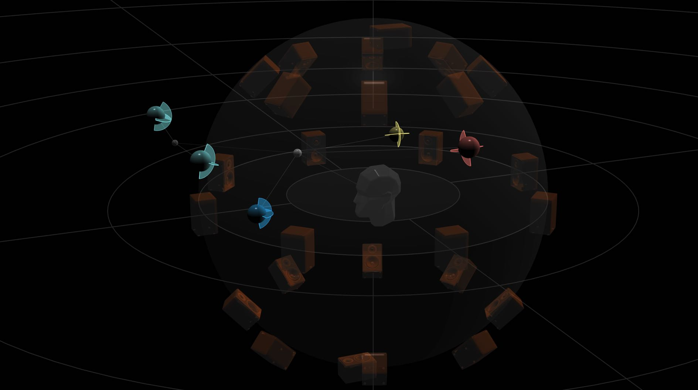
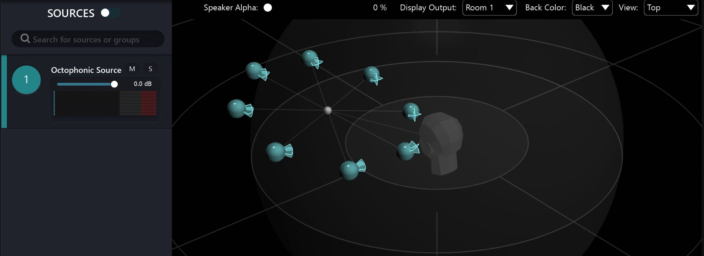

# 6.7.6 Virtual Room Concepts

## Simulated Speaker Diffusion

When a Virtual Room is Channel Based, the speaker configuration layout is modelled as fixed speakers which appear in the Room graphically according to their
programmed positions ( _see section 4.5 Custom Speaker Configuration_ ) - you will
not be able to move those speakers around with the mouse. These fixed speaker
positions are virtualising a sound system configuration which is often the same one
that will be used for diffusion. These virtual speakers interact with the virtual
acoustics of each Room as designed by the _Artificial Reverberation_ editor (see section 8).

> ★ Each room can have a DIFFERENT Virtual Acoustic design and different sources.

The idea is that by simulating speaker positions and acoustic interactions, the
process of mixing for a particular speaker layout becomes more predictable. For
example, by monitoring binaurally a scene from a channel based room, it is possible to get an impression as to how the mix might sound diffused by a particular
speaker arrangement (including the space between speakers and gain characteristics belonging to selected panning types). As we have mentioned earlier in section
4.6 on Ambisonics, there are also options for mixing and monitoring a particular
Channel Based Room simulation transcoded to a different setup than that being
simulated, which may also be useful in certain contexts.

This is really all about mixing. Mixing in stereo is already a significant challenge,
some have devoted their entire careers to it. Mixing for multiple speakers, is even
more complex.

As mentioned in section 4.6 and other places in this guide, it is advisable to think in
parallel as far as room mixing gœs. You could think of SPAT Rooms as different
kinds of spatial busses with integrated acoustic emulation units. Use them in parallel, send some or all of the sources to multiple Rooms at the same time and sum
the outputs together into one output format. One room might have a huge reverb,
and one might be a much smaller space. The fact of the matter is that different

Channel Based Rooms will have different sounds, but they can all be summed into
the same channel based format.

It is only in this kind of Channel Based room workflow that the _Nebula Spatial Spectrogram_ will appear, as it works by computing a diffusion map from the combined
outputs of statically positioned sound sources - i.e. _speakers_.

In practice, the best mixes are attained by mixing on the same sound system in the
studio or venue as you have represented in the Channel Based Rooms. But there is
also the possibility of monitoring Channel Based mixing on headphones using the
binaural monitor or a dedicated, parallel, binaural room as mentioned in section
5.1. This is workable enough to allow you to keep on arranging a mix and spatial
composition 'off-location' without too many surprises when it comes to the final result.

> ★ Channel Based simulations render localisable virtual sources by
controlling the virtual speaker array in a similar way that panning-laws
do on real world physical systems. They do not model the positions of
virtual sound sources, but instead control the gains of the virtual
speakers in the model to render perceived positions.

## Multichannel Virtual Sources

All inputs to a Room must be in some kind of Channel Based format, even when
the Room is an Ambisonic or Binaural Room. Even a Mono source can be considered as a channel based signal of one channel (see section 6.41). For any source
that has more than one channel, it will be structured as a Channel Based configuration - and that configuration will be virtualised inside the Room as one single
source in an inter-connected cluster formation - this is designed to maintain interchannel spatial image relationships as much possible, keeping the multichannel
source in a discrete self-contained system. The sound, size and positioning of that
configuration can now be manipulated as a unified group.

## Speakerless Virtual Rooms - Binaural and Ambisonic

The better alternative to Channel Based simulations is to use a _Binaural_ or _High
Order Ambisonic_ room to mix. In these Room simulations, speakers and panning
are not simulated. Instead all the inputs into the room become _Virtual Sources_ they become sound emitters in the virtual space. To get a grasp on how mindbending this is, we need to go through it a little.

In a fully virtualised Ambisonic room, the _Nebula Spatial Spectrogram_ will no
longer be available, as it is too complicated to compute the spatial-spectra of moving sources. No visualisations of speakers will appear either, as they are not being
modelled.

So far, we have established how the audio technology at the heart of SPAT is capable of simulating precisely the emissions of virtual speakers at fixed positions,
and the way they interact with virtual acoustic space.

But the real big achievement of SPAT and High Order Ambisonic is the modelling
of virtual sound sources that are changing orientation, size and position. SPAT can
model these _and_ simulate the changing response of the acoustic space to these
complex, dynamic and _imaginary_ sound diffusors.

This is where we touch on what 'virtualisation' of sound sources really means.

The technology of Virtual Sound Systems and Virtual Spaces invites us to stretch
our imaginations beyond what is possible on a physical installation and into a place
where sound emitters can continuously alter their structural dimensions, orientation and acoustic characteristics - the idea of speakers as fixed objects no longer
applies in the virtual acoustic space. Instead, sound emitters grow wings and become complex musical elements to be organised and composed in time and
space, contributing even more to the cultural experience of music.

## Upmixing and Downmixing

One workflow that is often required, is that of re-mixing a pre-rendered channel
based mix of a particular format, to get that mix expressed into a different channel
based format. For example, the need to down mix a 5.1 surround into stereo is
quite common, but also the other way - perhaps a 5.1 surround mix needs to be
up-mixed to a 7.1.
One way to do this, is to use an Ambisonic Virtual Room as a way to simulate the
source configuration as if it were being diffused in a space, in its correct speaker
format and with simulated, full sphere acoustics and then transcode the output to
the desired format.
Here is an example of that in the Room view. Notice how it is possible to re-balance and re-mix the original using the perceptual factors or positional parameters.
A room simulation reverb is also playing a significant role in the cross-format mixing process, as the reverb simulation adds new spatial information to the mix,
which might help get a more immersive result in the output format.

This is an example of a multiple format changing signal graph, which changes format in two ways, to provide an alternative result. Firstly, by transcoding the output
of an HOA Room into various other Channel Based formats, but also a room that
simulates how the target speaker configuration might render the source speaker
configuration. Both methods will give different results and the choice is up to the
designer.

Options are available when _transcoding_ (aka _decoding_ ) from a High Order Ambisonic room into a Channel Based stream. These decoding options will affect the
sound in quite different ways - luckily it is possible to listen to the results of different Ambisonic decoding options in realtime. More about this in section 6.7.8 which
details more on the HOA Room concept.

## Virtual Stereo Diffusion and Microphones

When a Virtual Room is set to be Channel Based / Stereo it will model a stereo
speaker system in the virtual room acoustics _and_ virtualise stereo microphones in
real-world stereophonic recording configurations. This is a hybrid approach, where
you 'record' the sources positioned in the Room through virtual matched pair microphones at the listener position, as if you were miking up a concert for stereo
broadcast or playback. The microphone modes were described in section 5.68 and
become available under the Panning Type menu of the Room when it is set to
Channel Based Stereo.

You will notice how the Spat Reverberation handles the stereo image naturally, because it is modelling the entire mix scene in the acoustic context of a Virtual Room,
rather than the conventional 'voltage controlled' left-right pan pot that all audio
mixers offer for stereo mixing.

This method of working in a stereo Room invites a different approach to stereo
panorama source mixing in the studio or on twin stack PA systems. It can also be a
way to down mix from a surround format to stereo by simulating the speaker configuration and 'recording' it in stereo.

One final thing to note when working in an Ambisonic room, rather than a channel
based room, is that the feeling of **Artificial Reverberation** (see section 8) that gets
encoded into the High Order Ambisonic will have a much reduced strength than
what is heard during a channel based room mix. This needs some trial and error to
get a feel for

