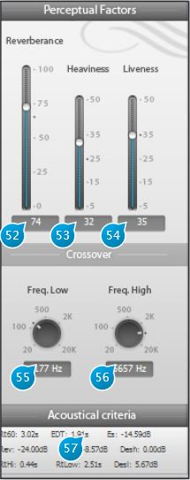

# Perceptual Factors

## (52) Reverberance
Reverberance affects the amount by which the listener perceives the music to
be prolonged by the reverb, when the musical message suddenly stops. The
effect of this setting is also obvious when the source material is of percussive nature. Reverberance is tightly 
related to overall decay time of the mid-frequencies, which in turn is the time taken by the late reflections to vanish
into silence.

## (53) Heaviness
Relative decay time of low-frequency content, relative to the reverberance.

## (54) Liveness
Relative decay time of high-frequency content, relative to the reverberance.
Describes the liveliness and movement associated with the reverb tail (late
reflections).

## (55) Freq. Low
Sets the frequency below which decay time is determined by the Heaviness
setting, expressed in Hertz(Hz). 

Default value: 180 Hz

## (56) Freq. High
Sets the frequency above which decay time is determined by the Liveliness
setting, expressed in Hertz(Hz). 

Default value: 5657 Hz

## (57) Acoustical criteria
