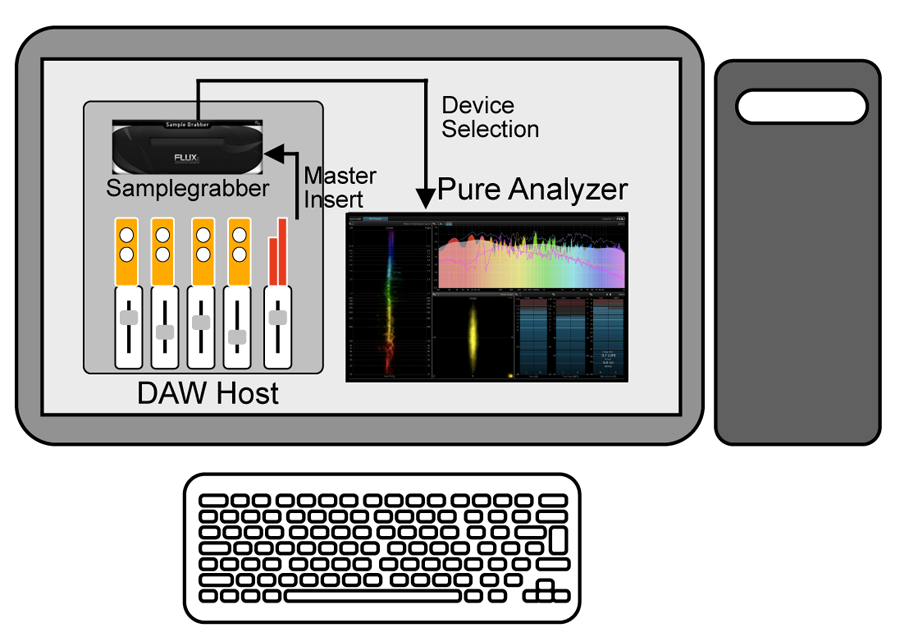
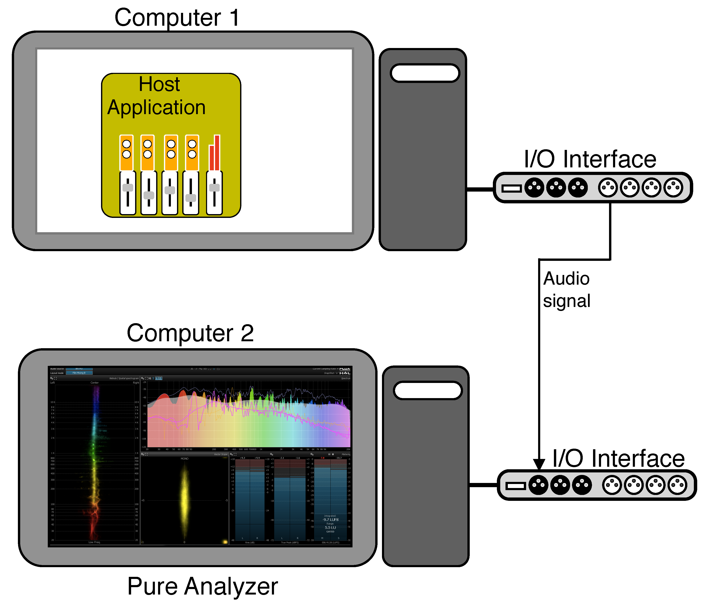

# Digital Audio Workstation
Any recent computer should be able to run Pure Analyzer smoothly in a stand-alone configuration. Running your preferred DAW host application alongside with an instance of Pure Analyzer naturally raises the requirements. Operating in this way will most probably require a dual-screen setup in order to be able to monitor the Pure Analyzer display and DAW interface simultaneously.

> SampleGrabber and Pure Analyzer running on the same machine

> Audio source and Pure Analyzer on separate hardware