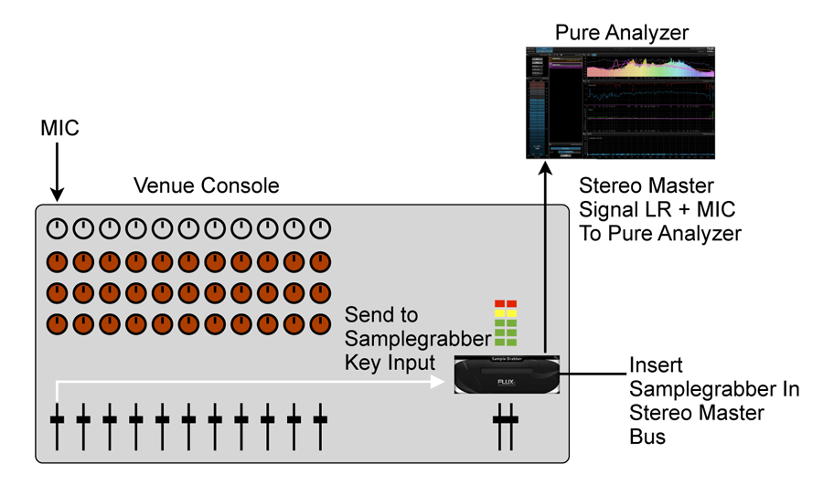

# Avid Venue Console
SampleGrabber is available as an AAX DSP plugin, which is the preferred format when using an AVIDVenue live console. Using one or more SampleGrabber instances will free up several precious hardware outputs.

When performing transfer function and impulse response measurements, a recommended way of working is to insert a SampleGrabber on the master output and set the microphone signal as key input. This simplifies the routing and allows for fast switching between different microphones.

> Recommended setup with Avid Venue console