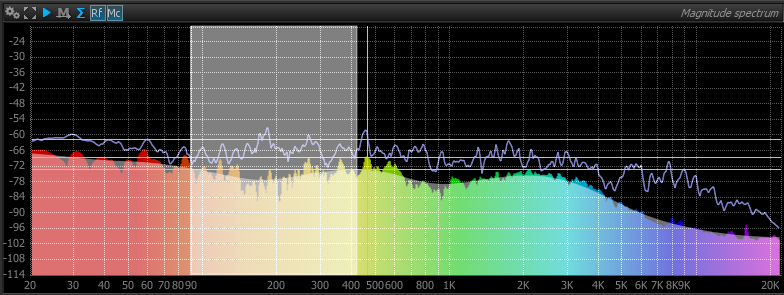
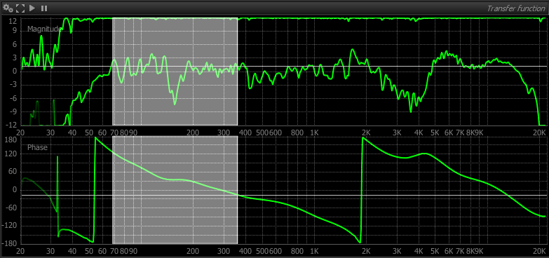

# Mouse commands and conventions
The following mouse click actions are available:
## Left-click
Selects the active element.
## Right-click
Toggles the display of the corresponding setup menu for the item beneath the current mouse location.

## Modifier + click
<code>Ctrl-click</code> is equivalent to <code>right-click</code>.

Inside a setup menu item, <code>Alt-click</code> resets the corresponding setting to its default value.

<code>Alt-click</code> inside an item with a zoom factor greater than one, resets the current zoom to full view (Factor = 1).

## Double-click
Double-clicking on an editable control such as a slider or text box enters keyboard entry mode, double-clicking again validates the new value.

Double-clicking anywhere inside a panel switches the panel to full-window mode, where the whole application screen is occupied by the corresponding panel; double-clicking a second time reverts to
the normal layout.

## Click and drag
<code>Click + drag</code> inside an item with a zoom
factor greater than one shifts the current scale.

<code>Alt + Click + drag</code> inside an item with a Zoom Factor
allows to setup a new zoom according to the defined selection.

## Scroll wheel + click and drag
Turning the middle mouse wheel, if present,
affects the current horizontal zoom level of the item under the cursor.

Activating the wheel with the middle button simultaneously engaged shifts the current scale when the current zoom factor is greater than one.
