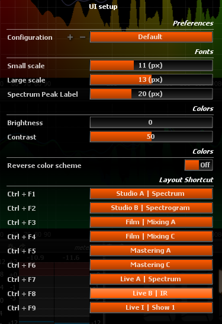
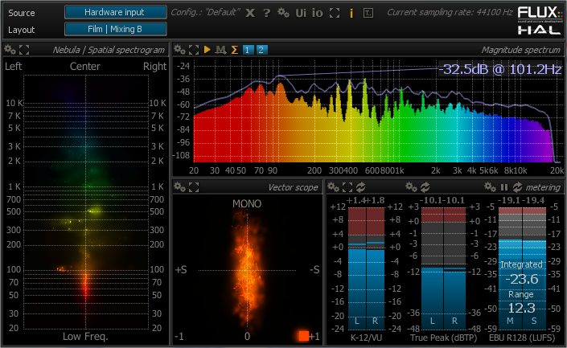

# UI Setup

> User interface setup dialog

## Configuration
Saves / restores a complete user defined configuration.

## Fonts: Small Scale
Sets the size of the smallest font used for drawing the grid labels.

## Fonts: Large Scale
Sets the size of the largest font used for drawing the grid labels.

## Fonts: Spectrum Peak Label
Sets the size of the font used for the Spectrum peak label.

## Brightness
Adjusts global user interface brightness.

## Contrast
Adjusts global user interface contrast.

## Reverse color scheme
When engaged, the user interface color scheme switches from white/grey on black to black/grey on white, for improved readability in an outdoor environment.

>Reverse color scheme off.

> Reverse color scheme on.

## Layout Shortcuts
This list allows you to set up to nine shortcuts for direct access to your most frequently used layouts.
