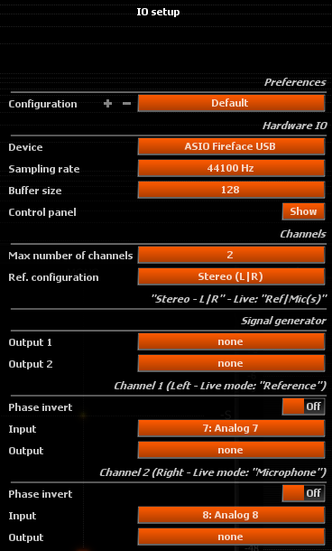
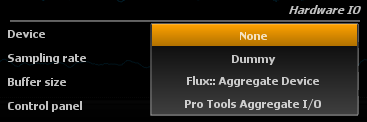
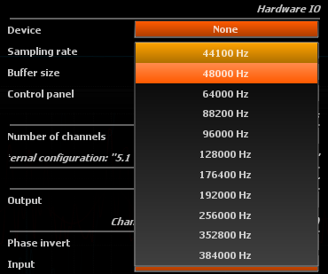
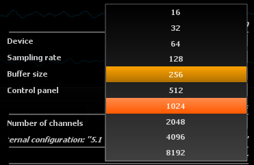
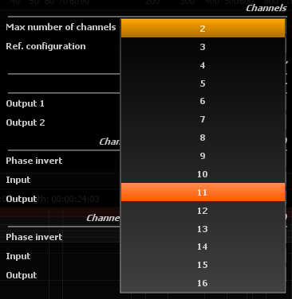
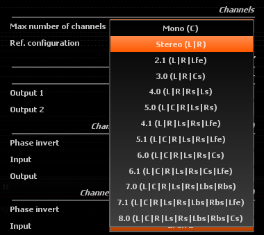
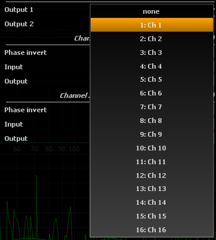

# IO Configuration

> IO configuration dialog

## Configuration
Saves / restores a complete user defined configuration.

# Hardware IO

## Device

This setting lets you choose amongst a selection of devices, depending on your particular hardware configuration.

!> **IMPORTANT!** - The Pure Analyzer Studio Session supports audio input only by using the SampleGrabber plug-in. 
No hardware input/output options are supported for the Pure Analyzer Session.

### None
This disables hardware input and output altogether. This is the recommended choice if you do not want to take advantage of Pure Analyzer's built-in audio capabilities, for example if you're working with a SampleGrabber inside a DAW or Avid Venue console setup. With some sound cards that aren't multi-client capable - meaning only one program can access it at once - disabling I/O is necessary to continue using another program simultaneously.

### Your soundcard
Any installed soundcard(s) will be listed here. Under Windows, it might appear several times, in which case be sure to select the native ASIO driver for performance, not an emulated driver which be labeled something like ASIO DirectX Full Duplex Driver, Generic Low Latency ASIO Driver or similar.

## Sampling rate

> Available sampling rates (hardware specific)

Sets the sampling rate used internally by the application. When a hardware device is selected, be sure to match this to the sampling rate set in the application panel of your soundcard control panel. We deliberately chose not to employ resampling, which in our opinion has no place in a measurement instrument. Instead we generally advise you to set your soundcard's sampling rate to 44.1k or 48k, which covers the entire audio hearing range (20-20kHz). Increasing the sampling rate above these values increases the processing power required to carry out the computations without any benefit for most practical applications.

## Buffer size

Displays the current soundcard I/O buffer size. Depending on your soundcard, you might be able to change this to a different value directly in Pure Analyzer without opening its control panel beforehand. Smaller buffer sizes leads to a shorter latency between incoming audio, display update, and audio output. This setting is certainly not as crucial as in the context of live sound processing, so there is no need to go down to extremely small values here, as this only increases the system load without offering any practical advantage.

Keep in mind a display refresh rate of 60Hz means one frame lasts for approx. 16ms, which is a bit longer than one 512 buffer at 44.1kHz, so the display will always lag less than one frame after the audio with such a setting.

## Control panel
Opens the ASIO (Windows) / CoreAudio (MacOS) control panel for the selected soundcard driver, where you can make further settings depending on your particular hardware, such as routing, input gain etc.

# Channels

## Max number of channels

Selects the maximum number of channels to be used by the application, or equivalently the number of channels in the application I/O bus. You should set this according to the source material format you want to analyze and visualize. This determines notably how many real-time curves are displayed in the [Spectrum analyzer](03_Spectrum_analyzer_01_Basic_principles.md) view, whether the [Surround scope](06_Nebula_Surround_scope_01_Usage.md) is displayed, etc.

!> **IMPORTANT!** - The Pure Analyzer Studio Session supports only 2 channels of audio.

## Reference configuration

> [Reference](07_Metering_01_RMS_Metering_03_Reference.md)
configurations available with 8 max. channels

Depending on the setting above, the possible standard channel configurations will be listed here, and will be a subset of the following:

* Mono (C): single center channel
* Stereo (L|R): two left-right channels
* Surround: various standard configurations depending on the exact channel count

The channels are labeled according to this configuration to make them easier to identify.

# Signal generator
## Output

> Example of a output channel routing (hardware specific)

Selects one or two physical channels to which the [Signal generator](12_Signal_generator_01_Signal_types.md) output should be sent.

>In case of stereo output, the signal is identical on both channels. This is provided as a facility for soundcards with minimal routing capabilities, and to avoid using a Y patch cable.

# Channel 1 / Channel 2
The following group of settings are displayed for every channel selected in [Channels](02_User_Interface_06_IO_Configuration?id=channels). The heading displays the channel number, followed by its name, and whether it corresponds to the reference or microphone input signal for the first two channels in [Live IO](11_Live_IO_00_Live_IO.md) mode.

## Phase invert
When engaged, the phase of the corresponding channel is inverted in order to compensate for a reverse polarity somewhere else in the signal chain. Default is off.

This can happen with incorrect or non-standard wiring, when a phase switch is engaged on the preamplifier, an analog device has an odd number of inverting stages … Use this with caution as it can compromise measurements if the “real” input signal phase does not match.

### Input
Selects which hardware device input should be routed to the corresponding internal application input.

### Output
Selects which hardware device output the corresponding internal application output should be routed to.

