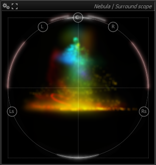
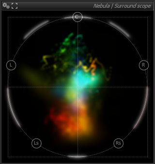
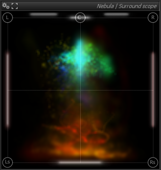
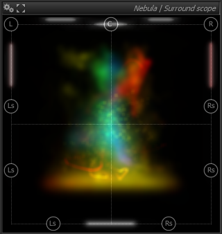

# Usage
The Nebula | Surround scope displays a representation of how a surround signal's various components are distributed in a surround environment. 
The inner region displays the location of the signal frequency components in the selected surround configuration, while the outer ring shows the phase-correlation between channels.

Phase correlation between adjacent channels is shown as white section with a length proportional to the correlation. 
Additionally, L-R phase correlation is displayed on the top portion of the ring, and L-C and C-R inter-channel phase correlations are displayed just above the top of the ring.

Physical locations of the speakers for the selected configuration are marked on the ring itself for reference.

# Music
This is the typical surround speaker arrangement for musical reproduction.

> Nebula | Surround scope in Music speaker mode

# Equidistant
This mode employs equidistant speakers arranged as an equilateral polygon.

> Nebula | Surround scope display with equidistant speaker mode selected

# Square
This arrangement employs speakers arranged on a square.

> Nebula | Surround scope display in Square speaker mode

# Theater
This is the typical arrangement employed in movie theaters, with redundant rear channels.

> Nebula | Surround scope display in Theater speaker mode

