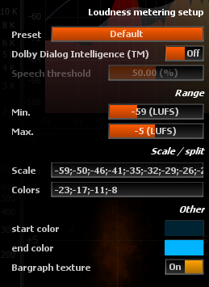
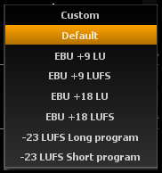

# Setup

> EBU R128 Loudness metering setup.

## Presets

### Custom
Uses user-defined custom range according to min./max. values below.

### Default
Sets the meter to the recommended scale (EBU +18 LUFS).

### EBU +9 LU
Sets the meter to use EBU +9 scale in LU units.

### EBU
+9 LUFS
Sets the meter to use EBU +9 scale in LUFS units.

### EBU +18
LU
Sets the meter to use EBU +18 scale in LU units.

### EBU +18 LUFS
Sets
the meter to use EBU +18 scale in LUFS units.

### -23 LUFS Long program
CST specification

Sets the meter to use EBU +18 scale in LUFS units with reference @ -23 LUFS and color split @-/+ 7LU from the reference.

### -23 LUFS Short program
CST specification

Sets the meter to use EBU +18 scale in LUFS units with reference @ -23 LUFS and Max defined 3LU up to the reference.

## Dolby Dialogue Intelligence

### Dolby Dialogue Intelligence (TM)
Toggles usage of Dolby Dialogue Intelligence speech gate.

### Speech threshold
Defines the speech content threshold in %.
Speech channels with a speech content ratio below this value do not participate in the Loudness computation.

## Range

### Min.
Minimum Loudness to display on the bar-graphs. 
User adjustable.

### Max.
Maximum Loudness to display on the bar-graphs. 
User adjustable.

## Scale / split

### Scale
Meter labels are defined here as a comma separated list of dB values to be shown on the side of the meters. 
This also defines where to the corresponding horizontal markings. 
Default is -72;-40;-18;-9;-6;-3;-1;0;1;3.

### Colors
This lets you customize the values at which color transitions occur. 
You can enter as many values as you wish, as a comma separated list, but make sure the values are in increasing order. 
Default is -9;0.

The last value always defines the clip level, which will be indicated in red.

## Other

Controls whether meters are drawn with texture or in a plain solid color. 
Default is on.
