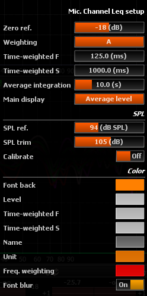

# Mic. channel Leq setup

 >Mic. channel Leq setup

## Zero ref.
Adjusts the reference point. See RMS for more information.

## Weighting
Frequency weighting employed. Can be switched between ANSI standard (A, B, C, D) and none. 
The default is A.

## Time-weighted F
Indicates the time-constant for the <i>Fast</i> time-weighted sound level.

## Time-weighted S
Indicates the time-constant for the <i>Slow</i> time-weighted sound level.

## Average integration
Sets the integration time for the time-average sound level, between 1s and 14400s (4 hours). Default is 10s.

## Main display
Switches the main measurement display from time-average sound level (the default) to sound exposure level.

