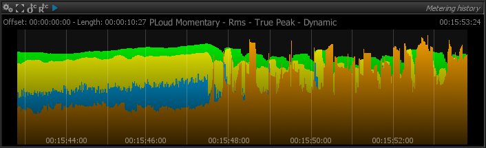

# Usage
The metering history panel stores and displays the evolution of meters over time, with a red vertical bar indicating current time. 
Start and end time-points of the period over which the history are displayed left and right in time-code format.

Selecting which meters are to be included in the display is done by clicking the corresponding buttons in the setup.

> Metering history display.

## Timecode offset
Clicking the  defines the current time as the Timecode offset.

## Timecode offset reset
Clicking the  button resets the Timecode offset to zero. 
Absolute and relative Timecode will then be the same.

## Play
Clicking the  toggles history recording on and off. 
Metering values are discarded when off.

> The metering history relies on the same settings as those defined in the various meters. However, when multiple meter values are displayed simultaneously, the display range of the history is adapted so it encompasses the display ranges of the meters.
>
> Keep in mind different meters can be set to different zero reference points when comparing meter history curves.

