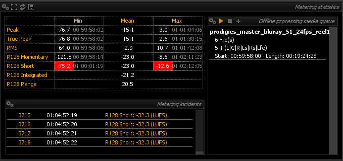

# Metering statistics
The metering statistics view shows a synthetic view of the current and past meter values in numeric form.
It also serves to process multiple existing audio files in one pass, display and export the results to disk.

> Metering statistics display

## Overview
The display shows the average and range for the various level meter values, since the start of the application or the last time the meter was reset, in a spread-sheet type view.

### Peak, TruePeak and RMS
Mean as well as overall minimum and maximum values are shown. 
For min. and max. values, the corresponding Timecode position is also indicated.

### Loudness
As EBU R128 Loudness already incorporates statistical computations, only the current values are shown.

## File export
Exports a report containing a summary of the metering statistics data to a text file.

Clicking the  button brings up a standard file dialog where you can specify the desired file name for the dialog.

## Setup

### Absolute Timecode

Toggles between relative and absolute Timecode display. 
See [TimeCode](08_Metering_History_02_Setup.md?id=timecode) for more information.

