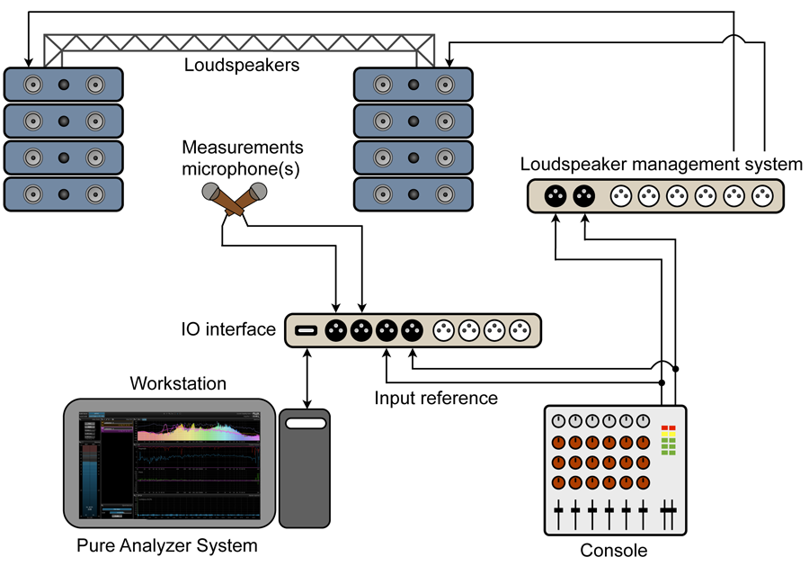
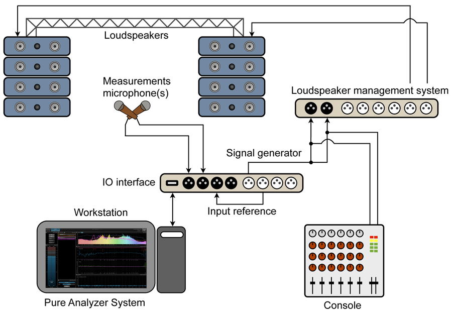

# Measurement setup

> Typical configuration for a live venue measurement setup using external signal generator.

> Typical configuration for a live venue measurement setup using Pure Analyzer's internal signal generator and loopback

