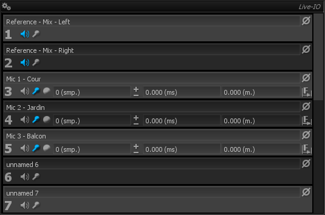
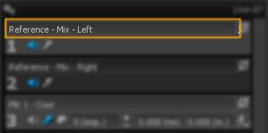
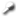

# User interface and controls

> Live IO controls.

## Name

Allows to define a custom name for each channel. 
This is a global name; saved and restored with the preset but not directly related to the Hardware I/O Interface. 
As this, it will be consistent even if you switch the Hardware I/O Interface or switch to connect to a [SampleGrabber](01_Initial_Setup_01_SampleGrabber_01_Principe_of_operation.md).

## Ref
The  button toggles whether the corresponding channel should be used as a reference signal.

Multiple channels can be used as reference, in which case a mono-sum of these channels is used as the internal reference signal.

## Mic
The  button toggles whether the corresponding channel should be used as a microphone input signal, which is used to capture the response of the system.

Multiple channels can be used as microphone input, in which case a mono-sum of these channels is used as the internal microphone signal.

## Phase invert
The  toggles
phase inversion of the selected channel on and off. 
This can be used to compensate another known phase inversion somewhere else in the analog signal chain.

## On/Off
The   button
toggles delay compensation on and off. 
When the correct delay has been determined, engage this button to insert a delay line in the reference channel, to align reference and measured signals, and get correct transfer function and impulse response.

## Delay value
The delay value is displayed simultaneously as:

* A number of samples (at the current sampling rate).
* A time delay, in milliseconds.
* A distance, in meters or feet.

You can manually adjust any of these values, using either keyboard input or fine increments with the up and down arrows; the two other values will change accordingly.

Please note precision of the distance value depends on correctness of the temperature value inserted in the main setup. 
In a concert hall with an audience present, there will probably important temperature variations, so this value should only seen as a rough measure.

Lastly, remember the delay value in samples is the master value, from which others are derived.

## Find
Clicking the 
 button starts a new delay value computation. Previous values, whether computed using the delay finder or entered by hand, will be erased. 
The algorithm accumulates a certain amount of incoming signal before the actual computation is actually performed, to ensure the delay is always computed using the most current audio.

## Progress
An informational text showing the progress of the computation is shown when the  delay find button is clicked, as well any error potentially encountered.
