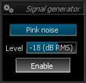
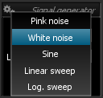

# Controls

> Signal generator controls.

# Type

Sets the signal type to generate.

# Level
Output level of the waveform, expressed in dB RMS.

# Enable
Toggles signal generator output on and off.
