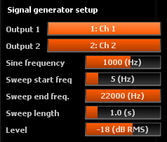

# Setup

> Signal generator setup options.

## Output
Selects the hardware output(s) to which the signal generator should be routed. 
Set to? None? to disable the signal generator output entirely.

### Output 1
First generator output.

### Output 2
Second generator output.

> Both signals sent to the hardware output channels are identical.

## Sine frequency
Sets the frequency of the sine generator, only applicable when the signal type is set to Sine.

## Sweep start/end frequencies
Sets the range of frequencies to sweep.

> Reverse start and end frequencies to obtain reverse sweep.

## Sweep length
Sets the overall duration of the sweep in seconds,<i>i.e.</i> the time taken to go from start to end frequency.

## Level
Generator output level in dB RMS.

