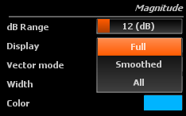

# Magnitude

## Range
Minimum and maximum values to which the display is clamped, in decibels.

## Display
Toggles between various combinations of raw and smoothed magnitude curve display.

> Available magnitude display modes

* Full : main unsmoothed magnitude curve.
* Smoothed: smoothed magnitude only.
* All: both.

Keep in mind the smoothing process can filter out a lot of information, so relying solely on the smoothed curve should be avoided.

## Vector mode
Toggles vector averaging of the transfer function magnitude on and off.

Vector mode computes the average sum of magnitudes and magnitudes multiplied by coherence. 
In vector mode, the averaged magnitude is therefore and indication of the perceived magnitude spectrum, <i>i.e.</i> the sum of the direct path and diffuse field signals.

Default is off.

## Auto-Range
Toggles auto-range on and off. 
When enabled, the display range automatically follows that of the transfer function magnitude curves, which is useful for hands-free operation, for example. 
Default is off.

## Width
Size of the pen used to draw the magnitude curve.

## Color
Color of the pen used to draw the magnitude curve.

