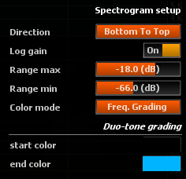
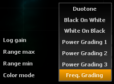

# Setup

> Spectrogram setup

## Direction

Defines the scrolling direction of the spectrogram.

## Log Gain
Toggles logarithmic scaling of the magnitude spectrum on and off.

Default is on.

When enabled, the magnitude at a time-frequency is applied a logarithmic scaling before being converted to a pixel value. 
This has the effect of compressing the dynamic range, and makes low energy components stand out more, but also decreases the contrast of the display.

## Threshold

### Threshold min
Sets the minimum amplitude spectrum value to be displayed.

### Threshold max
Sets the maximum amplitude spectrum value to be displayed.

## Color Mode

### Duotone
In this color mode, the amplitude of a time-frequency point is mapped to a pixel using a two-color palette, set using start/end colors.

### Black On White
In this color mode, the amplitude of a time-frequency point is mapped to a pixel using a Black &amp; White color palette with White as background.

### White On Black

In this color mode, the amplitude of a time-frequency point is mapped to a pixel using a Black &amp; White color palette with Black as background.

### Power grading 1, 2, 3
In this color mode, the amplitude of a time-frequency point is mapped to a pixel using different predefined color palette.

### Frequency grading
In this color mode, the amplitude of a time-frequency point determines the intensity of the corresponding pixel, whose color varies according to frequency.

### Duotone start/end colors
Sets the color to use for minimum and maximum amplitude components respectively, when color mode is set to 'Duotone'.
