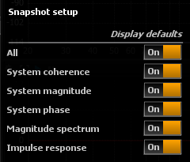

# Setup

> Snapshot setup options

## Display defaults
Toggles the default curve visibility applied to newly created snapshots.

'All' controls whether new snapshots should be visible by default, and you can fine-tune which curves should also be shown/hidden here.

