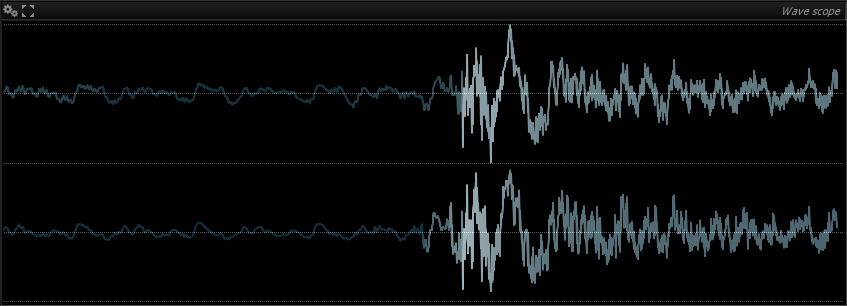
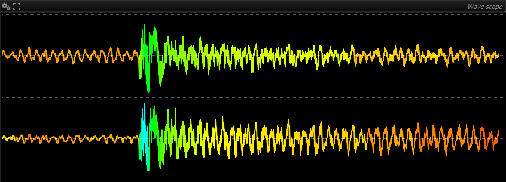
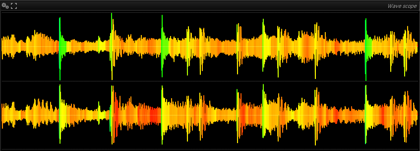

# Wave scope
The wave scope is a simple oscilloscope-type waveform display.

> Wave scope display with stereo input.

>The wave scope will include more functionality and settings in future releases.

