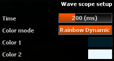

# Setup

## Time
Time window in milliseconds.

## Color Mode

### Static
Displays the waves using 1 unique static color.

### Custom Dynamic
Displays the waves according to the transient using a 2 user defined colors gradient.

### Rainbow Dynamic
Displays the waves according to the transient using a rainbow colors gradient.

