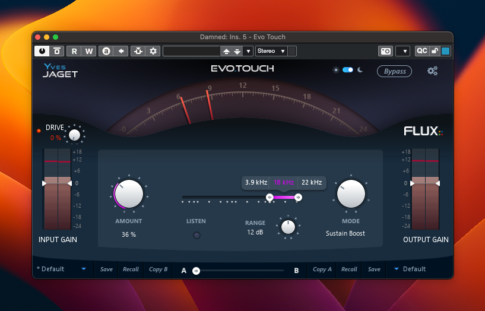

[Product Page](https://www.flux.audio/project/evo-channel/) 
| [Shop Page](https://shop.flux.audio/en_US/products/evo-channel)

# Introduction

**EVO Touch - The icing on the cake that brings out the magic !**

The Final Touch module EVO Touch, also available in EVO Channel, is a polymorphic section offering a variety of different processors designed to adapt to the requirements of the material, with seven different processing modes including a frequency dependent DeEsser, Expander and a Transient and Sustain Designer.

