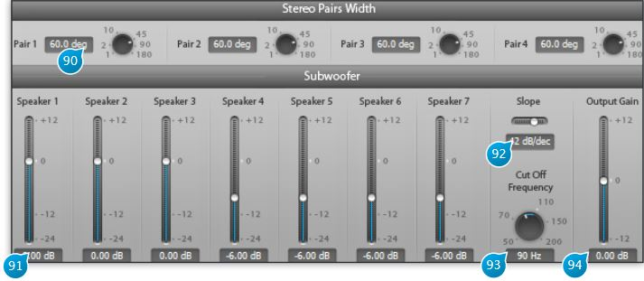

# Stereo Pair Width - Subwoofer

## (90) Stereo Pair Width
Sets the width of a stereo pair, if previously defined, in degrees.

## (91) Subwoofer Speaker Gain
This is the send level value from each of the Spat reverb outputs having the Subwoofer checkbock ticked, expressed in dB
(deciBels).

## (92) Slope
Slope of the low-pass filter section applied to the subwoofer buss, in dB per octave.

## (93) Cut Off Frequency
Cutoff frequency of the low-pass subwoofer section, expressed in Hz (Hertz, default 110Hz). This filter ensures only the
frequencies reproducible with a subwoofer are sent to the corresponding hardware output.

## (94) Subwoofer Global Output Gain
Adjusts the overall gain of the subwoofer buss.
