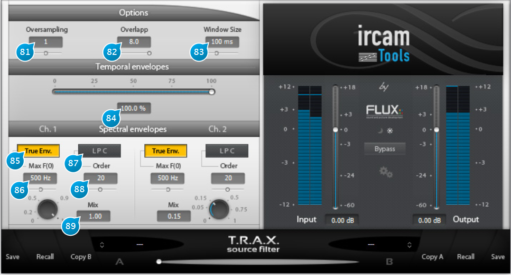

# Source Filter

The Source Filter is an advanced type of vocoder to morph the spectrum and dynamics of one signal into another.

The plugin relies on a source-filter model of sound to gradually combine a source track and a filter track into the 
output, by gradually mixing their dynamics, i.e. time envelope or signal level contour, and spectrum, i.e. the structure of
amplitudes versus frequency.

The source-filter model fits the physical description of human voice production quite well, with the source being
the vocal cords and the filter the vocal tract. Some instruments fit this rough description too. For example, for the
clarinet, the source would be the reed and the filter the instrument cavity. Simple analog synthesizers also use the
source-filter paradigm, in form of one or more frequency-controlled oscillators fed to various kinds of low-order filters.

> NB: Ch.1 corresponds to the left channel of your DAW track, Ch2 to the right one.

## (81) Oversampling
Adjusts the oversampling factor, set to zero (none) by default. Increasing this setting can increase the processing the 
processing quality, depending on the audio material, although at the expense of higher CPU usage, which roughly doubles
for every increment.

## (82) Overlap
This determines how much extraction windows overlap during a given time-frame, or in other terms, how often the analysis
is updated for a given window size. Increasing this setting usually gives better results but also leads to more CPU resources
being used, as more data has to be analyzed. The default setting of 4 is a good trade-off, but you should try to go above
this value if you have a reasonably fast machine and hear a noticeable difference.

## (83) Window Size
Window size determines the time-frame base used to extract time-localized data from the incoming material. As general
guidance, window size should be small for fast tempos and larger for slow music.

## (84) Temporal envelopes
The slider controls the blend of dynamics between the two channels. In other words, this controls how much of channel 2’s
versus channel 1’s dynamics will be imprinted onto the output signal.

## (85) True Env.
Sets track analysis to True Envelope mode, an advanced proprietary IRCAM algorithm.

## (86) Max F(0)
When True Envelope mode is selected, this sets the maximum allowed fundamental frequency to track, depending on the
input material. Avoid setting this unnecessarily high as this might increase the possibility of tracking errors.

## (87) LPC
Sets track analysis to LPC (Linear Predictive Coding, for filter coefficients prediction) mode, which is a classic source-filter
estimation method.

## (88) Order
Determines the order or number of coefficients used in the LPC prediction algorithm. The higher this setting, the better the
LPC can adapt to the hills and valleys in the spectral envelope, but this also increases the chance of over-adapting to the
short-term variations in the signal, which leads to artifacts.

## (89) Mix

