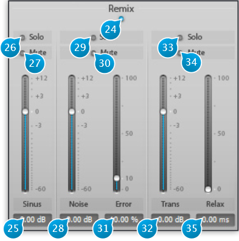

# Remix

## (24) Remix On / Off
Toggles the Remix console in and out of the signal path.  
When disengaged, all signals are simply summed back with equal gain, and the processing does remain active.

## (25) Sinus
This channel contains the sinusoidal components of the source sound, with or without modification depending
on target, modulation and spectral envelope settings.   
Sinusoidal components represent the regular part of the sound, e.g, the pitched part of musical instruments or the
long resonances of cymbal and bells

## (26) Sinus Solo
Isolates the Sinus Channel.

## (27) Sinus Mute
Mutes the Sinus Channel.

## (28) Noise
Contains the noise part of the material, i.e. anything that doesn’t have a defined pitch and does not possess a 
transient quality.

## (29) Noise Solo
Isolates the Noise Channel.

## (30) Noise Mute
Mutes the Noise Channel.

## (31) Noise error
Sets the amount of allowed error, in terms of statistical content, at the analyzer stage. This controls how the pitched and
noise content are allowed to overlap. Most of the time you can leave this at the default value of 10%.

## (32) Transient
Contains the transient part of the material, which has a rapidly changing energy profile. In other words, this is the attack or
percussive phase of a sound, if any. Please note Transients are only computed when the Transient button is enable in the
Options panel (See 47).

## (33) Transient Solo
Isolates the Transient Channel.

## (34) Transient Mute
Mutes the Transient Channel.

## (35) Transient relax
Increasing this above the 0ms default setting allows to relax the transient detection scheme by the given amount, to let
more of the tail of a transient pass through. The effect is similar to that of the release control found on a compressor
A two-band filter section that can be applied on the incoming or outgoing material, depending on the Post setting.
