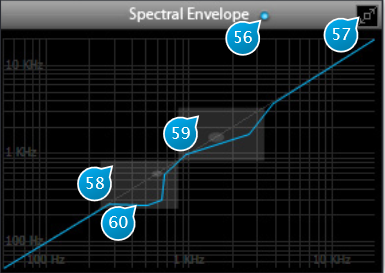

# Spectral Envelope

The Spectral Envelope allows for complex remapping of the spectrum envelope, according to a freely definable curve.
At startup, the spectral envelope is a diagonal line, giving a 1:1 remapping of the spectrum, i.e. no modification.

## (56) Spectral Envelope
Toggles Spectral Envelope processing on and off.

## (57) Full Size Display
Toggles the size of the Spectral Envelope editor, for detailed editing.

## (58) First formant region
The first transparent gray square indicates the region of the first formant (200...800Hz) for an average human
voice, which corresponds to the first resonance of the vocal tract, and the gray disks to the average peak resonance
location (500Hz). Alongside with the second formant, this is the area that has the most influence when processing voice.

## (59) Second formant region
Second formant, ranging from 600 to 2.8kHz, peaking at 1.5kHz.

## (60) Spectral Envelope Curve
The curve defines how the input spectrum frequencies, on the horizontal axis, are remapped (transposed) on the vertical
axis.

Defining and modifying the curve is done by manipulating line segments using the following methods

* Double-click and drag on the diagonal blue line to add and place a control point
* Click and drag an existing point to move it
* Alt-click an existing point to snap it back to the diagonal line
* Ctrl-click (MacOS: Apple/Command + click) an existing point to constrain its movement and prevent it to go past or
beyond its immediate neighbors, which is useful when doing fine adjustments with a lot of points close to each other.
