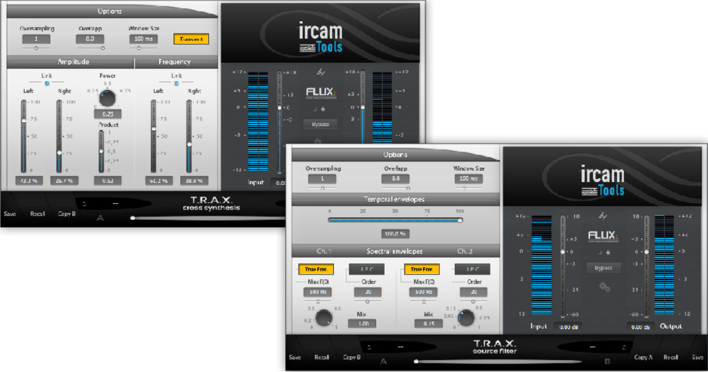

# Cross Synthesis & Source Filter Tools

## Introduction:

These plugins can only operate in a fixed 2 input - 2 output channel configuration only at the time of this writing.
The plugin treats the stereo input as a dual mono input, and the two channels stereo output are identical.
You will most likely want to use two separate DAW channels to be processed. The most convenient way to achieve this is
to create a dedicated buss , with the plugin as an insert, and two separate direct sends from each source channels to this
buss, panned hard right and left. You should probably also bring the corresponding channel faders all the way down and
set the send as "pre-fader" to hear the result of the processed signal only.
