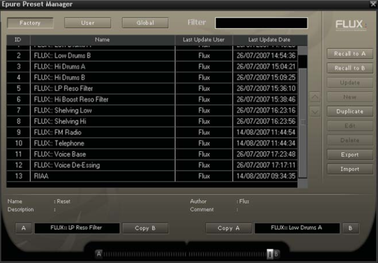
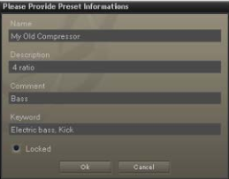

# Preset Management

## From the Plug-in interface

### A-B Sections
A plug-in features two preset sections : A & B. Clicking on the slot of a specific section reaches the shared preset bank.  
From the preset management window you can select the preset you want to recall in the specific preset section.

### Save
Save replaces the selected preset by a new one under the same name featuring the current settings. If you want to
keep an existing preset without your new modifications, just select an empty place into the preset list, enter a new
name for this modified preset featuring the current settings and press Save.

### Recall
Once a preset is selected from the preset list it must be explicitly loaded into the section A or the section B by using
the recall button. A preset is effective only after it has been recalled.  
Double-clicking on the preset name from the list, reloads the preset into the selected slot.

### AB Slider
This horizontal slider has no unity nor specific value display. It allows to morph current settings between two loaded
presets. A double-click on one side of the slider area toggles between full A and full B settings. The results of an in
between setting can be save as a new preset.

## From the Preset Management Window
The Preset Management Window features three preset banks:

- The Factory bank gathers presets that can’t be edited by users.
- The User bank is dedicated to the users presets.
- The Global bank features presets for A, B and morphing sections. A single global preset includes A and B section
content and the morphing slider position.

A Preset can directly be recalled into the preset section selected by the morphing slider position, by double-clicking
on its name on the list. The preset lists can be filtered. This filter is applied to any preset information such as name,
description, author, comments or key words.

### Recall A
Recalls the selected preset into the corresponding location.

### Recall B
Recalls the selected preset into the corresponding location.

### Copy A and Copy B
These buttons allow to easily create a variation around a preset.

### Update
Update the current preset with current settings.

### New
Creates a new preset in the list.

### Duplicate
Creates a new preset in the list based on the currently selected one.

### Edit
Gives access to an edit window where you can change the preset’s name, description and add optional key words, the
author’s name, etc.

### Delete
Suppresses the selected preset.

### Export
Saves the preset to a file on disk.

### Import
Adds existing presets into the preset bank.

### Sorting arrows
Moves a preset up and down in the list for sorting.

When engaged, the preset is protected, and any subsequent modifications or edits are allowed for the original author 
only. This comes in handy in a multi-user configuration. Protected presets can of course still be loaded or deleted when 
the user logs under a different computer session.
