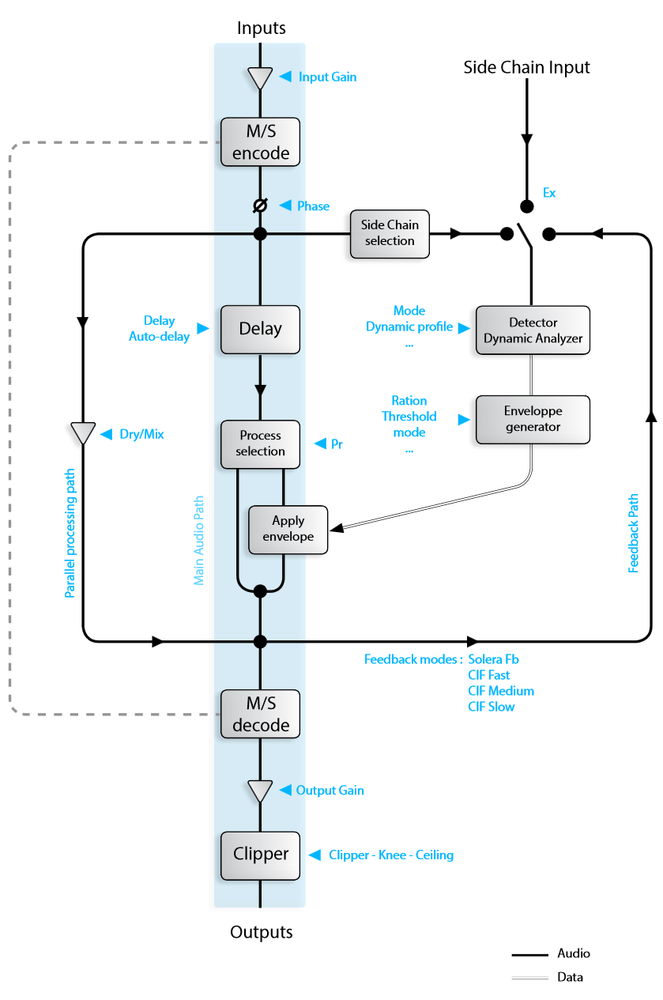
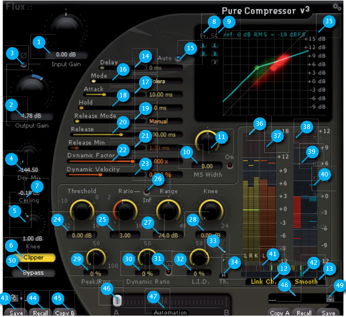

# Pure Compressor v3
[Product Page](https://www.flux.audio/project/pure-compressor/) 
| [Shop Page](https://shop.flux.audio/en_US/products/pure-compressor)

Pure Compressor is the compressor section of the Solera. A compressor is used to automatically reduce the gain
above the Threshold. Pure Compressor produces a wide range of compressions from ultra clean subtle compressions to classic heavy pumping ones - It’s all up to your artistic choices, not to the technology limitations.

The Threshold value is expressed in dB - The plug-in compares it to the RMS (Root Mean Square or effective power)
of the input signal. This value is displayed as a green rectangle on the input level meter.

The level variations above the threshold are affected by the Ratio value.

For a 1:1 compression ratio, the processed signal isn’t affected by the processing: A 1 dB variation above the threshold at the input is reflected by a 1 dB variation at the output. Try applying a 3:1 ratio, if the input signal rises above 3
dB the threshold value, the output signal rises only from 1 dB: Here is the compressor action. The input signal gain
is reduced by a 3:1 ratio above the threshold point.

The Knee sets how progressive is the start up of the compressor action – In other words, It smoothes the transition
point between no processing and full processing. If the Knee value expressed in dB is increased, the progressiveness of the action will be spread below and above the threshold point.

The Range value sets the processing maximum action. No gain variation can exceed this value.
