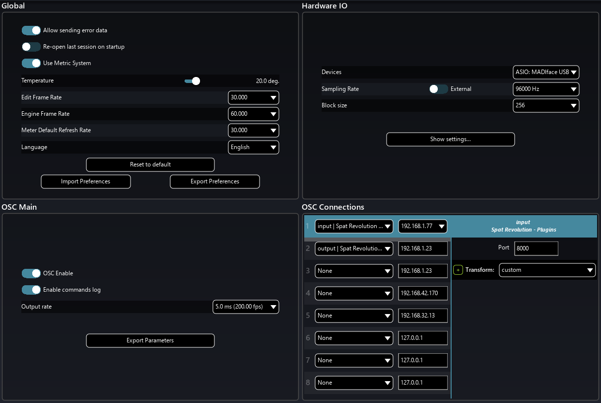
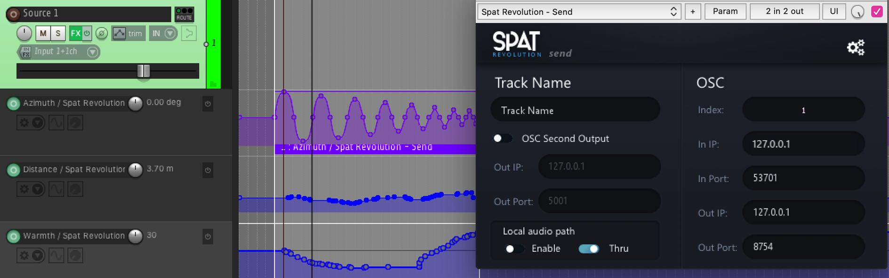

# Spat PI : Automation

A computer running Spat Revolution becomes a spatial sound rendering engine, hosting the entire Spat software environment we are currently describing. 
Audio signals that flow in and out of Spat may be connected to a hardware multichannel audio device connected to the Spat host machine.

Interestingly, a multichannel audio stream flowing in and out of Spat may not be coming from hardware at all, but instead connected through _virtual IO_ from another software application.

In the Spat environment this is made possible by a special set of plug-ins that enable audio to flow through 'virtual cables' between a multichannel DAW and Spat Revolution - _both running on the same machine_. 
This can become an ideal offline creation workflow for preparing content for an eventual complex hardware setup.

To understand the Local Audio Path flow better, let breakdown three setup scenarios.
## DAW Automation - Manual setup

When you are not using the local audio path workflow, and instead working directly with a connected hardware interface, then you must setup automation manually.

The first step is to go to the _Spat Preferences_ and _Enable OSC_.

You then need to set up an OSC port and host route, in order to connect with Spat plug-ins via OSC. 
The port and host should match that of the Spat plug-ins. 
If you are running Spat and the DAW software on the same machine, then the IP address is always the so called _LocalHost_ (127.0.0.1) - the port must be the same as in the Spat Plug-ins. 
Remember that the index number of each Spat plug in links it to a virtual source with the same index - or in the case of a Spat Room plugin - it is used to identify which Room you wish to control.

!> Some systems require you to press TAB key and not ENTER after editing a field in the Plug-in.

> All SEND plug-in instances in one DAW will have the same IP and port number
in the DAW, but different and unique Index numbers.
