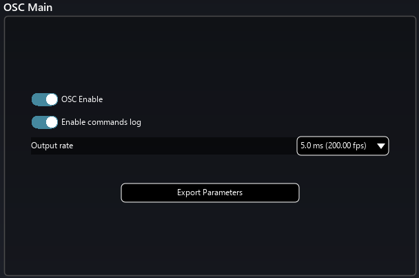
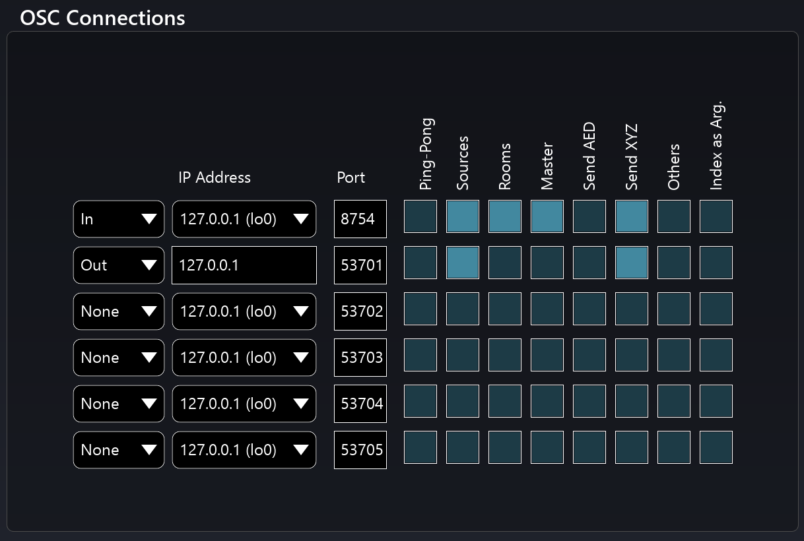
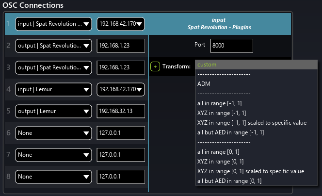
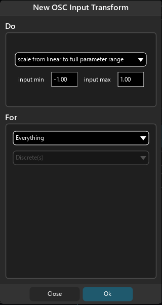

# Open Sound Control
## Introduction to Generic OSC

If you are developing your own control systems to integrate with Spat, you might find it useful to know that it is possible to export a detailed description of all OSC patterns, syntax and usage to a text file for reference. 
You will find that option in the Spat preferences.
You will also find a complete [OSC table](Appendix_C_OSC_Table.md) in appendix.

> Enable commands log will display the received and emitted OSC messages in the log windows to confirm you are receiving data. <code>Shift + F7 </code> will open the log window.

In general, Spat OSC patterns have the form of

<code>/source/[index]/x</code>

where [index] represents the Index of the Virtual Source or Room you wish to control with the message.

The three positional formats can be packed into one message if that option is set in the OSC Connections Matrix;

<code>/source/[index]/xyz</code> _Cartesian co-ordinates in meters_

<code>/source/[index]/aed</code> _Polar co-ordinates (azimuth, distance and elevation)_

!> Take care to automate EITHER Cartesian OR Polar, not both.

Sometimes, it is more convenient to have the [index] parameter as an argument of the OSC message. 
This option is available in the OSC Connections Matrix, namely Index as Arg. 
If this option is switched in, then the messages will be of the pattern

<code>/source/xyz ifff</code>

where <code>i</code> is an integer denoting the index of the target, and <code>f</code> according to convention is a float denoting the values of the message.

For more details about the Spat OSC dictionary and its usage syntax please refer to [Appendix C](Appendix_C_OSC_Table.md).

The output rate allows changing how fast the engine react to OSC messages.
The lower the value is, the more reactive Spat will be, but it will also increased the stress on the CPU.
If you experienced some CPU overload when moving sources through OSC command you can try to increase the value.
By default, it is set to 5.0 ms.

## OSC Connections Menu

There is a lot of flexibility in the OSC connection menu. You find it in the Spat Preferences page. 

Eight different connections can be setup, either as input or output connection. It is displayed as a table where each connection is a line. The first parameter is the connection type, which offer many presets for both input and output. Theses presets come with dedicated network ports.

OSC preset are:
- Spat plugins
- ADM-OSC
- Lemur
- Avid S6L
- Digico
- SSL Live

Then the IP address needs to be set. 
If the OSC connection is established locally, on the same computer, the port 127.0.0.1 is dedicated to local network usage. 
For other configurations, we need to inform the IP of the targeted device.

Lastly, the port number can be adjusted to a free one. 
If a "custom" preset is loaded, we most likely need to edit this parameter to establish a network connection.

### OSC Transform

Interfacing different devices and software in OSC can be problematic as each piece of equipment can have its own scale of value.
To overcome these difficulties, some OSC transform presets and a custom OSC transform menu have been implemented.

Transform presets are accessible for each OSC connection and allow some quick re-scalling of the values.

If the included transform preset does not fit our needs, we can click on the <code>+</code> button to open the custom OSC transform menu.
In this menu, we can choose how to scale our input our output values. We can also choose to exclude specific OSC command from the scaling rules.