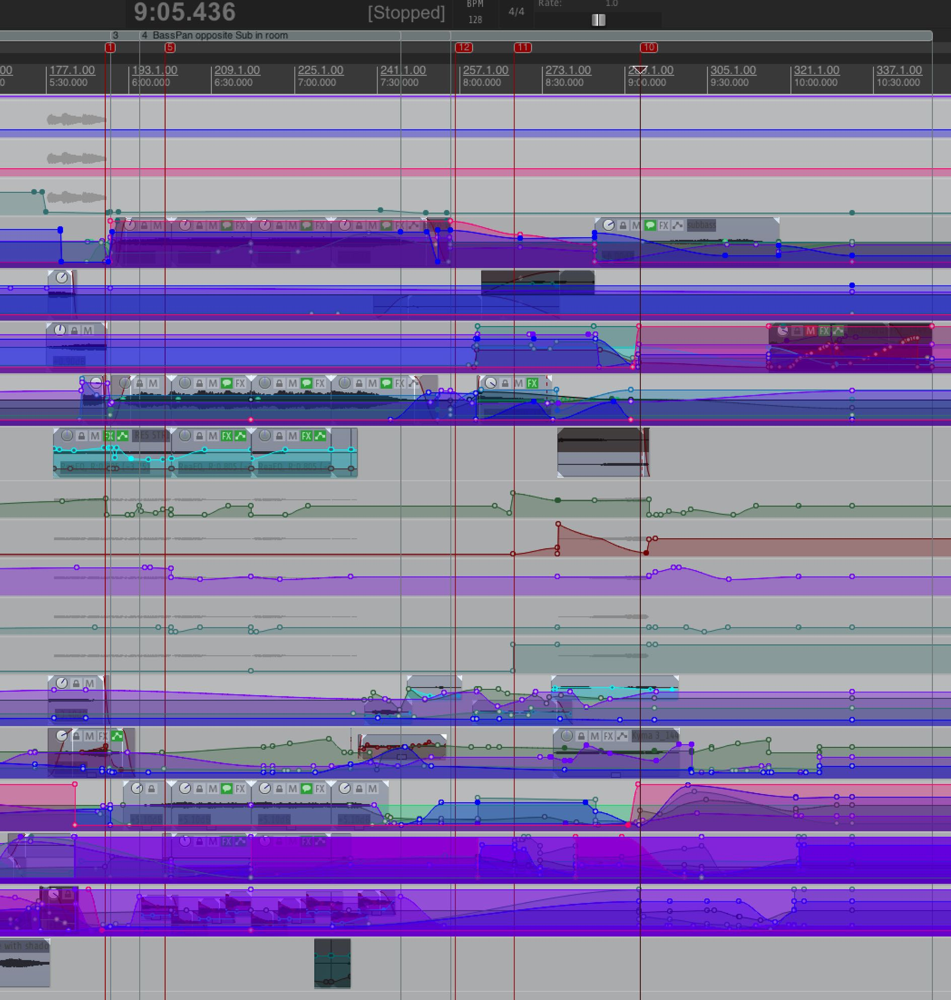
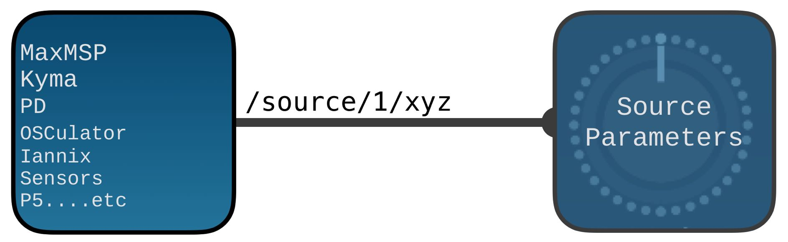

# Ecosystem & integration

Almost all parameters of Spat Revolution can be continuously controlled in realtime using Spat's high resolution _automated control_ features.

Control data can be sent via _Open Sound Control_ ( **OSC** ) or through multiple SPAT plug-ins in your **DAW**. 
Parameter control can be played back from pre-composed timelines, or performed, generated and captured in a variety of ways. 
One of the most straight-forward ways is to set DAW automation to Write mode on a track that contains a Spat Send plug-in, and use the graphical interface of the Spat Room Editor to drag Virtual Sources around or turn source parameter pots. 
The movements will be captured into the DAW timeline in precisely the same way you would capture automation from a conventional DAW plug-in, like [Reaper](Third_Party_Cockos_Reaper.md), [Reavolution](Third_Party_ReaVolution.md), [ProTools](Third_Party_ProTools.md), [Nuendo](Third_Party_AbletonLive.md), [Ableton Live](Third_Party_Nuendo.md), [Bitwig](Third_Party_Bitwig_Studio.md), or other.

Alternatively, a wireless OSC control surface such as _LEMUR_ running on an iPad could be used to control the parameters of Spat in realtime whilst you stand in the middle of the sound system away from the computer. 
There is already a fully programmed _Lemur_ template for Spat (see [Third party integration" - Lemur](ThirdParty_Tablet_Remote.md))

If you are using _Figure53 Qlab_ for show control, spatial effects can be sent along with the rest of the audio visual cues for a big show or event (see ["Third party integration" - QLab](Third_Party_Figure53_QLab.md)).

If you are working with algorithmic gesture generators and modulators then your controls signals can be easily sent into the Spat Renderer via OSC to distribute and control spatial sound sources in realtime using your own control programs.

> **Get creative with spatial sound design using OSC and Spat**

