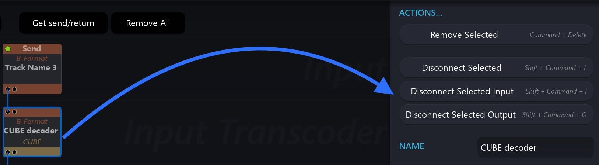

# 11.2 Disconnecting and Connecting

As mentioned earlier on, it is recommended to use _Disconnect Selected_ type Actions before going for a _Remove Selection_. This is because the graph will automatically re-organise itself when Modules are deleted and this could be difficult to revert. It is also worth knowing that you can multi-select modules (using _CommandClick_ or _Lasso select_ ) before choosing an action, and all modules in the selection
will be affected by the action.

> ★ Try not to Remove Modules until you are certain that this is the
correct edit action.

