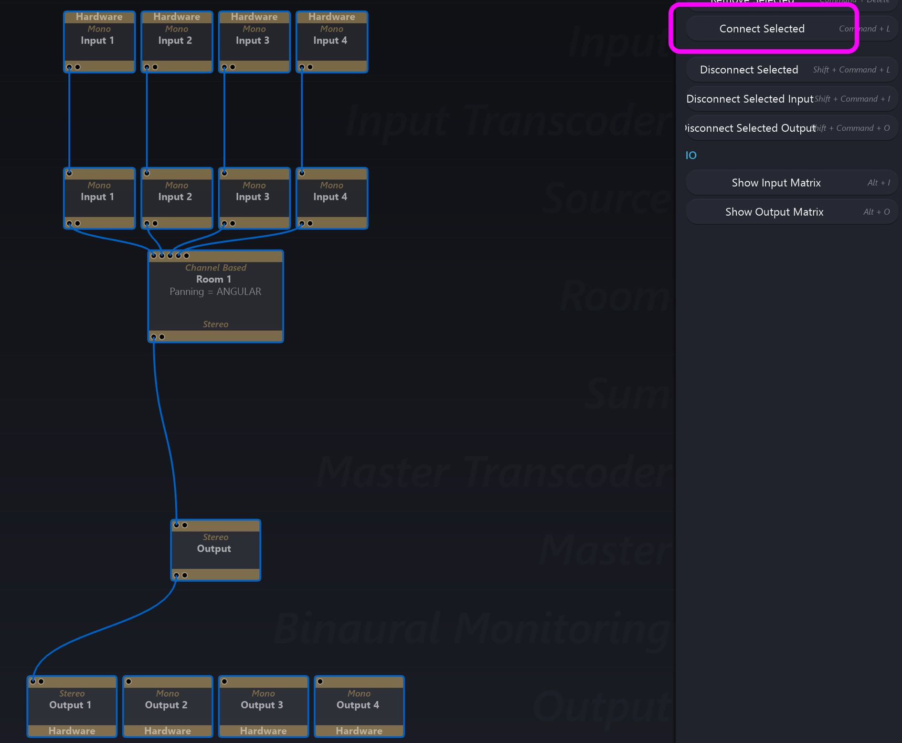

# 11.3 Quick Start Graph

Spat will automatically wire up a suggested signal graph, adding modules in-between as needed when you choose a _Connect Selected_ Action between modules.
This is particularly useful for fast setup from scratch. Add some inputs on the top
row, add some outputs on the bottom row. Select all and choose _Connect_. A starting signal graph will be generated automatically.

See example below.

