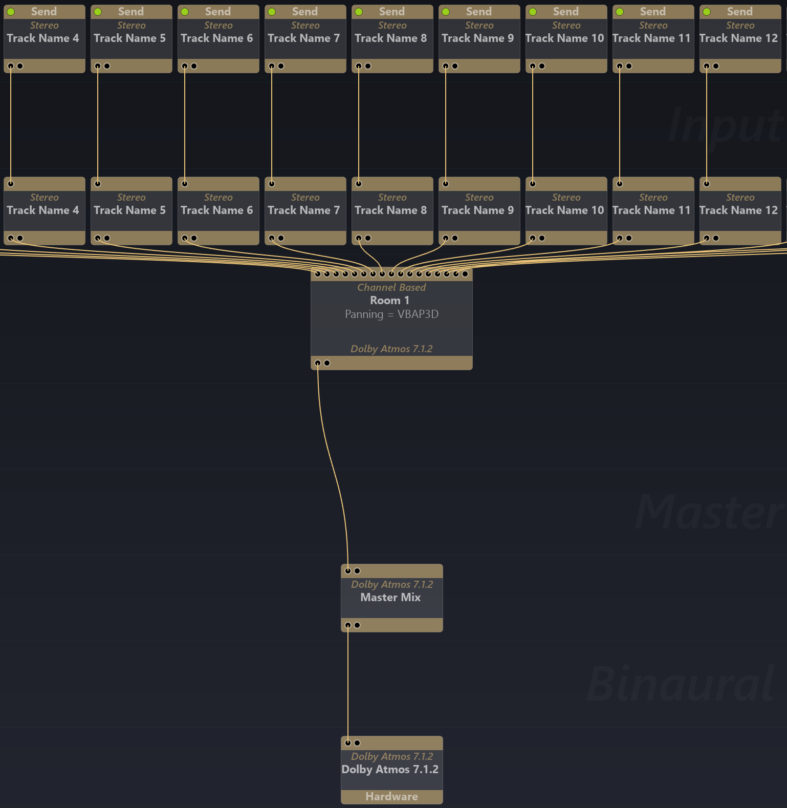
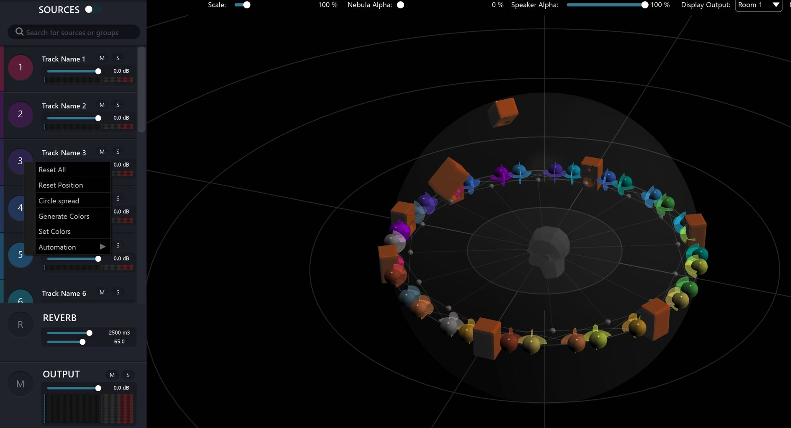
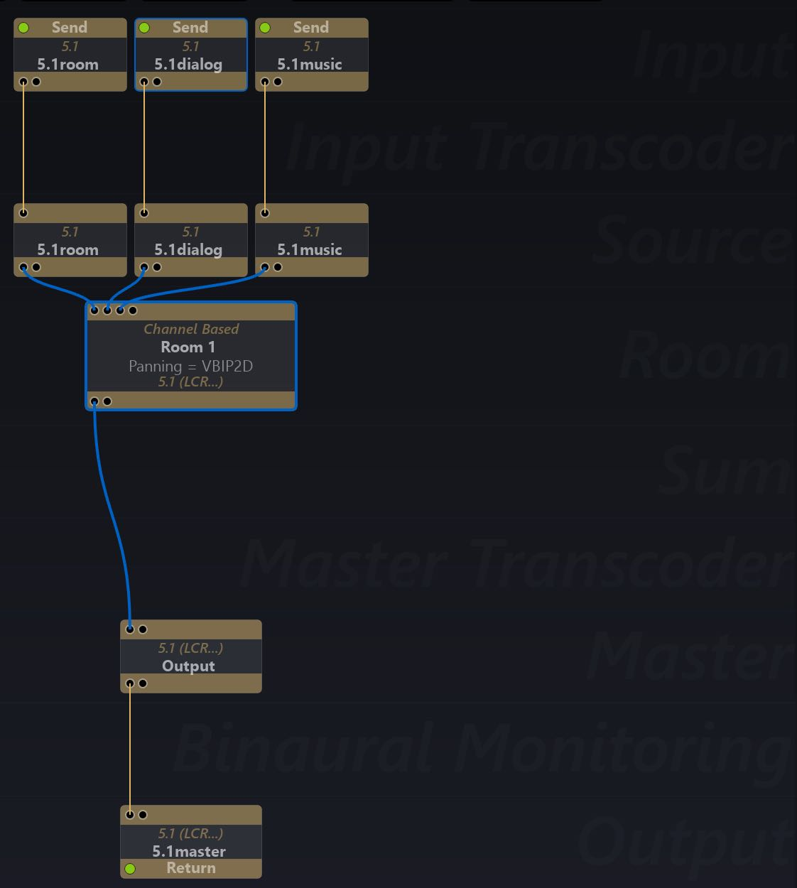
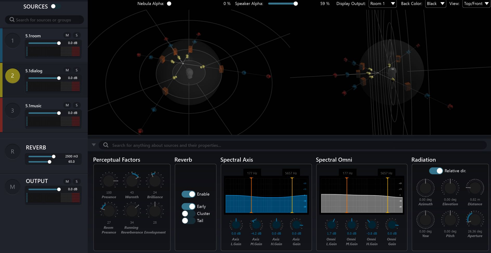
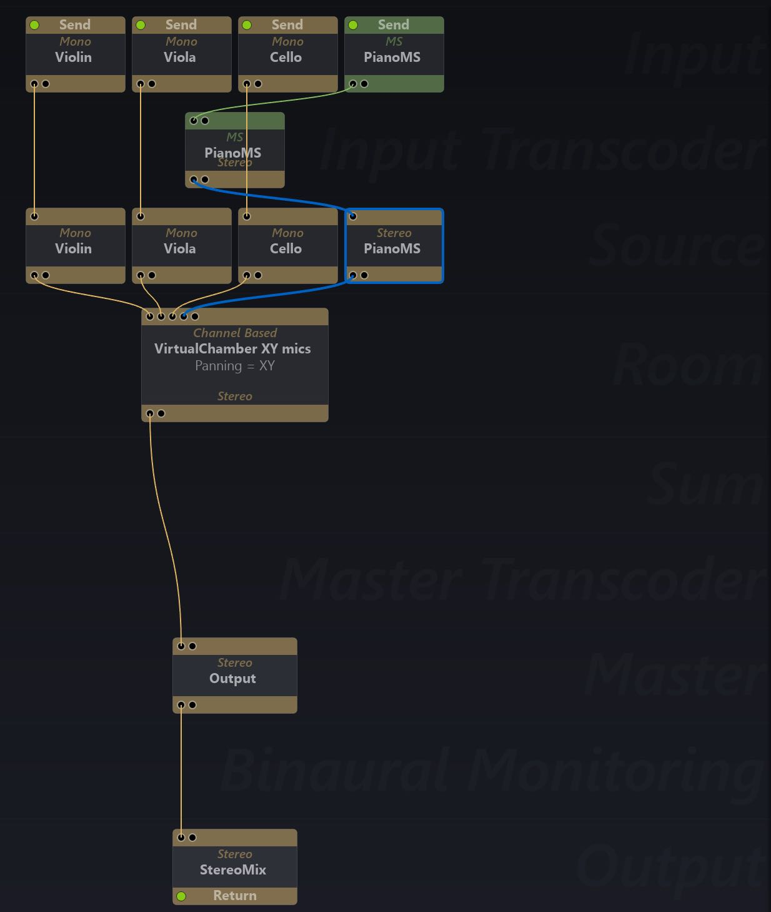
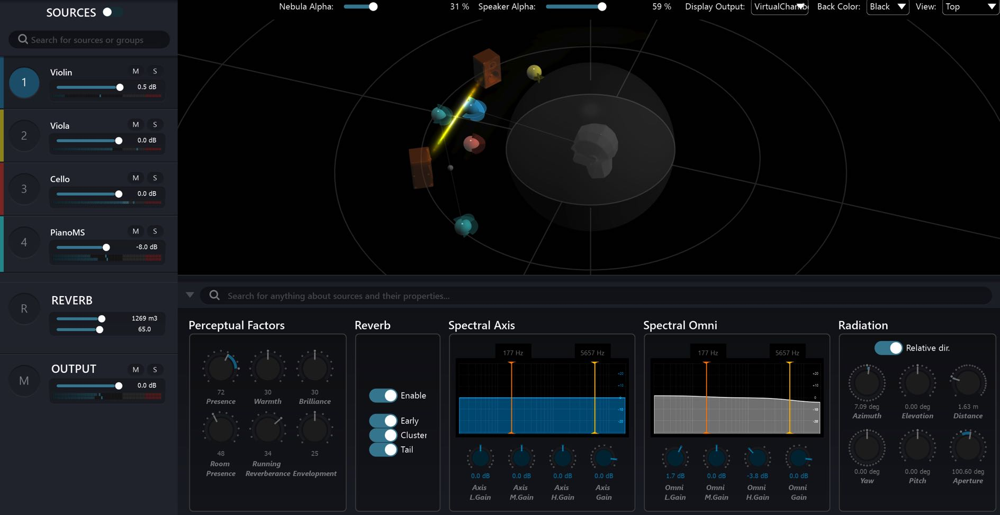
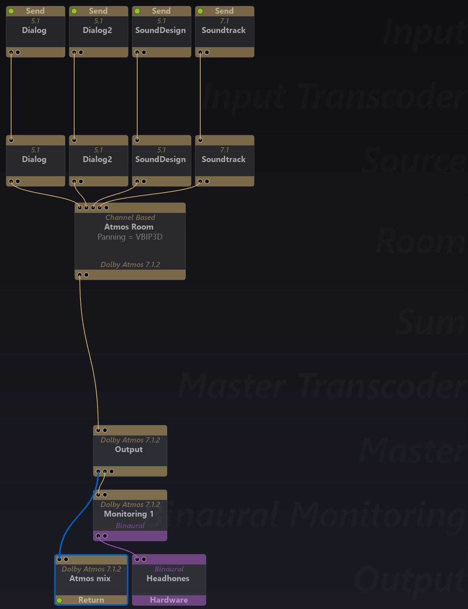
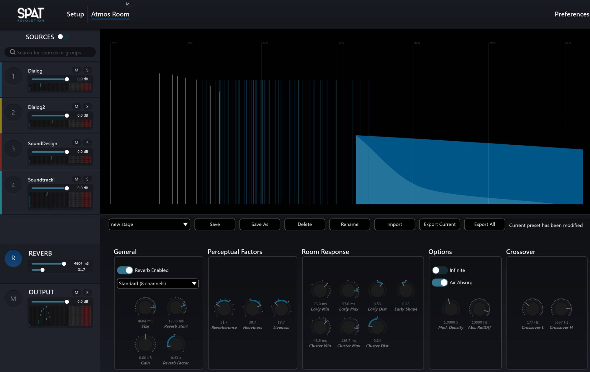

# 11.5 Channel Based Setup Examples

In the following brief setup examples, we first suggest a basic signal flow graph. Of
course an actual input and output configuration may be quite different, or much
more varied depending on the project context. For example, the inputs could be
live microphone sources, or Spat SEND plug-ins or hardware routings. There then
follows a single snapshot of a Room Editor view accompanied by some short suggestions of what kind of activity and processes could be going on during such a
workflow.

These examples are by no-means fixed 'recipes' , but simply suggestions to help
develop an intuitive approach towards finding good starting points for different
types projects.

**Dolby Atmos 7.1.2 Room with 16 stereo sources**

**_Setup View_**

**_Room View_**

- Select All ( _Command-A_ )
- _Generate colours_
- _Circle spread_

**Mixing Surround Sources**

**_Setup View_**

**_Room View_**

- Using _Scale_ and natural distance drop off to mix
- Using _Aperture_ , _Filters & Perceptual Factors_ to mix
- Different Reverb sections enabled for each 5.1 group

**Mixing Acoustic Music in Stereo**

**_Setup View_**

**_Room View_**

- Stereo Room with XY Microphone Panning Type
- Using _Filters Position & Perceptual Factors_ to mix
- Small 'Chamber' like Reverberation design

**Upmixing Surround Formats**

**_Setup View_**

**_Room View_**

- Design a new sound stage acoustic to up-mix into
- Mix using Source Gains, _Barycentric_ and _Radiation_
- Mix using _Filters_ (on and off axis)
- Mix using different _Reverb Send_ sections
