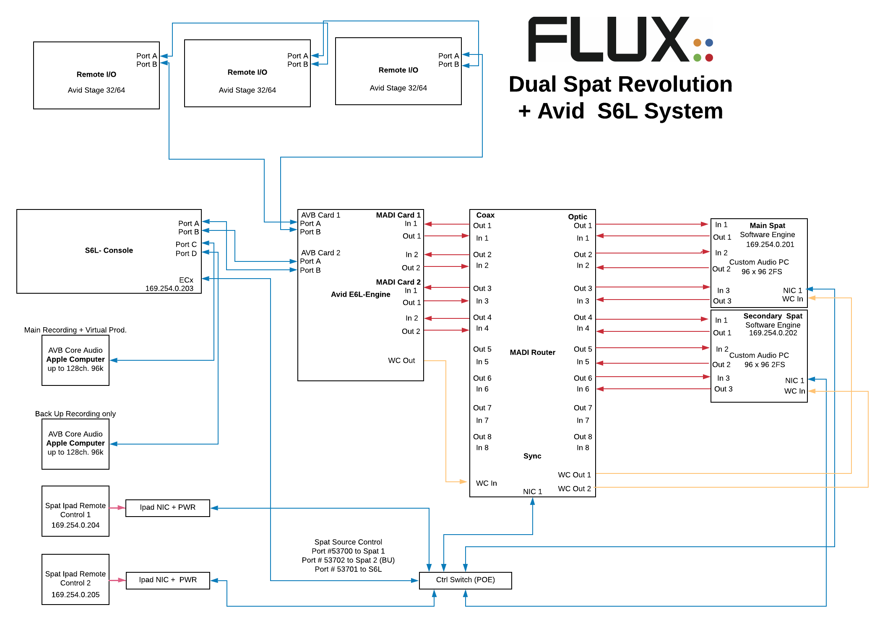
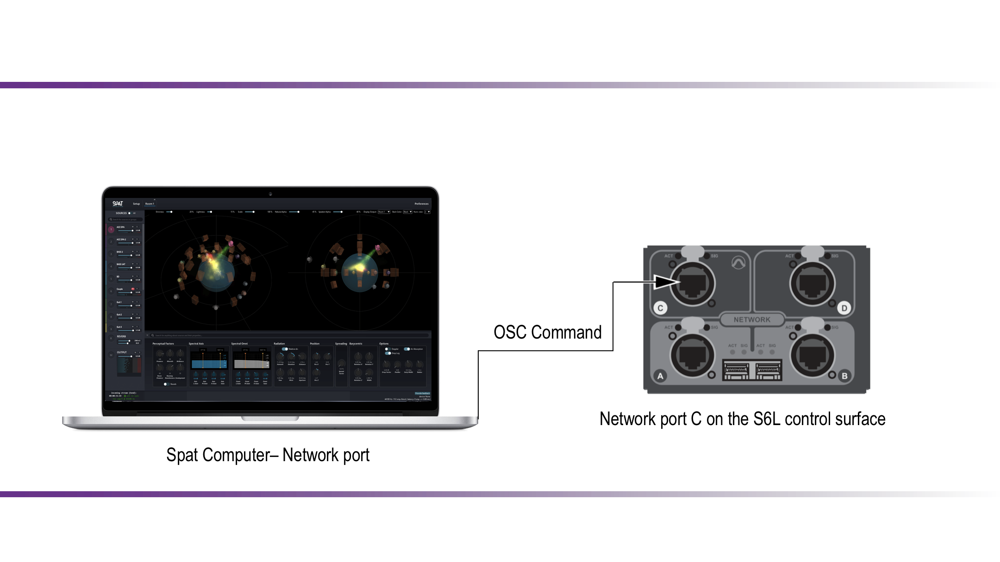
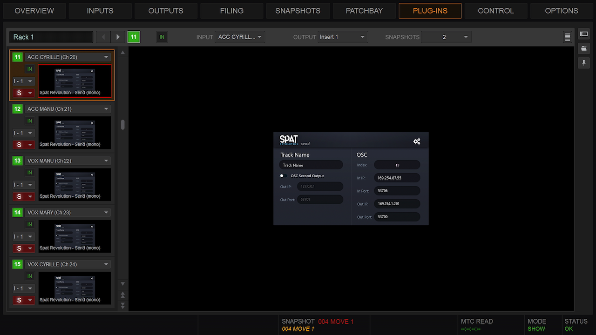
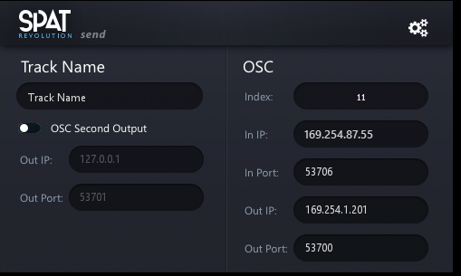
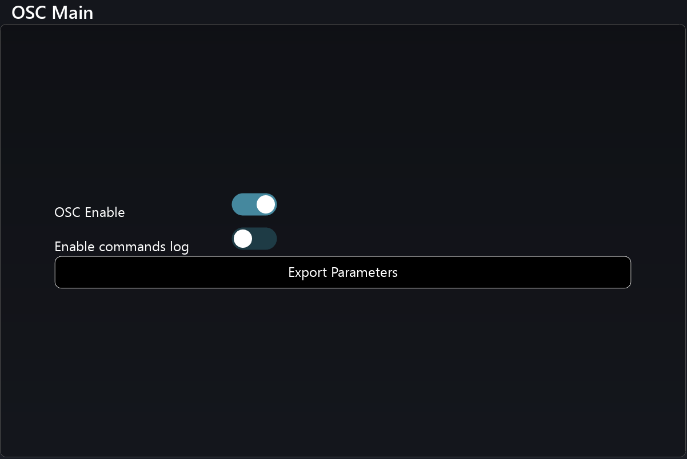
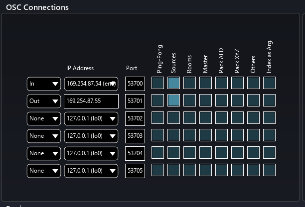
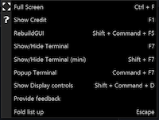

# 12.5 Avid VENUE S6L

Currently, Spat Send is the only available plug-in from Flux:: for the Spat Revolution integration to **Avid VENUE S6L** platform. The mono or stereo plug-in instances provide the integration of the Spat source parameters into the channel strip (insertion on the channel for source parameter control, no audio processing) 

The plug-in offers the ability to control the Spat object/source parameters and automate them within the VENUE show file and the VENUE Snapshot system. Ultimately having a completely integrated control of the objects in the 3D space. Added to the Spat Revolution source parameters are global and per parameter time values the user is able to use to set a linear morphing between two parameter states over a period of time to create smooth transitions. Thus creating movements in time with the VENUE Snapshots.
 
The OSC (Open Sound Control) part is the key aspect to this integration as when properly configured, the console will be sending OSC commands to Spat Revolution software (OSC Out) and receiving OSC commands into the S6L console (OSC In). Thus for a bidirectional configuration. This is what the Spat Send plugin does on the console. Optionally is the ability to set a second OSC output from the console to send to a backup Spat Revolution computer engine (unidirectional). The bidirectional aspect will mean that creating a sound scene in Spat revolution interface (or from third party interfaces) will automatically push the information to the plug-in instances on the console. 

 
**Spat plugin on S6L CKM module – Page 1 of 4**

The integration will include ultimately 2 parts. The control portion and the audio portion. Although our control will always be using OSC and will be communicating via either the ECx port of the console of via the AVB port C. You can choose the network interface the control is flowing. The audio routing portion can take different scenarios. An example could be using the AVB audio capability of the S6L system integrated to a Mac qualified computer. In this first case audio and control will be flowing on the same network port (Port C on console).  More frequently than other at this point people will rely on legacy MADI integration in order to leave the AVB entity dedicated to Recording and playback scenarios. If the route of the MADI integration is taken, then control will be happening from the EXc port on the console. This is a cross platform solution Windows or Mac

 
**Dual Spat Revolution integration to S6L via MADI**

 
**Spat Revolution integration to S6L via the AVB port for audio and control**

Now let’s look at configuring  the control (OSC)  part of this integration. The OSC settings (Spat send plug-in and Spat Revolution) are specific to your console and to the Spat Revolution preference

 
**Spat Send Plugin in the Plug-Ins rack of VENUE**

 
 	
**Spat Send Plugin setup**

The PI interface doesn’t have much and it straight forward:
 
- Index refers to the object / source number in Spat application. This gets automatically generated every time there is a new instances in the console. (It can be changed by snapshots but it is unique and no instance can take over a currently used index).

- In IP. Pull down will allow you to choose the ethernet interface you will be listening to OSC commands in the S6L coming from Spat  (you will need this address for setting up Spat preference later). This can be the AVB port 169.254.x.x or your ECx port of the console depending on the integration route.

- In Port#:  This port#  will need to be the corresponding Port# on your Output OSC port in the Spat application preferences. It can be left to default. (more on this later)

- Out IP. Is the manual address ex: 169.254.x.x that your Spat application computer is configured at.

- Out Port#: This port#  will need to be the corresponding Port# on your Input port in the Spat application preferences. It can be left to default. (more on this later)

- Second Output checkbox is to send the same commands to a backup Spat system Yes redundancy! This is unidirectional and you only need to set the IP address destination of the second Spat application computer together with a different Port#

**Note that any changes you do to properties to the Spat Send interface gets done across the board (across all PI instances, except the index which is unique)**

Let’s now setup your preferences in Spat Revolution preferences page :

- Hit preference in the right corner. Look for the OSC connection section. You will see  6 OSC slots… Set one to In and one to Out.  We will use 2 slots for this. Out will be to go to S6L Spat Send PI. In will be to listen to S6L in SPAT. First you want to make sure that the checkbox Enable  

 	
**Spat OSC Connections preferences**

 	
**Spat OSC Connections Matrix**

Set the In IP address by pulling then the menu and choosing for example the 169.254.x.x of your Spat application computer (or whatever network interface you are using for this communication)

- Set the In port # to the desired port #. This is the port # that you have in the Out Port # of the S6L Spat Send PI. For Example you can use 53700
 
- Set the Out IP address by putting the IP address of the S6L Console (you will have to take this address from the In IP on the S6L Spat send PI instance in your console)
 
- Set the Out port # to the desired port #. This is the port # that you have in the In Port # of the S6L PI. 
 
- On the 8 checkboxes (Ping-pong, Source, Room, etc) you will for now just engage Source on both the In and Out (Basically we are only moving source objects on this integration for the moment)

**We recommend in the Spat OSC Main section to activate "Enable commands logs" option in order to confirm OSC communication . Pressing Shift + F7 will give you a mini log window to see if the traffic is flowing. It is not recommended to leave commands logs enabled past the confirmation testing step. This will ensure that you don’t take up resources.**

**Shift + F7 Mini Terminal**

- Let’s now look for the  Hardware IO connection. This is where we will configure the hardware input and output (audio interface) for Spat Revolution

 preferences – AVB example.png)	
**Spat Hardware IO (Audio) preferences – AVB example**

- In Devices, please select your core or asio audio device. In this  example we are using the AVB Core Audio E6 Engine entity in 128 channel mode but this could be as well your MADI interface of choice such as an RME MADIface, MADIface XT, Soundgrid device or any preferred interface. Not that the choice of interface will have an impact on your overall system latency
 
- Sample rate should be set at 96000 Hz and buffer can be set to your desired buffer (mind lower buffer will required good computer resource and may not need to be extremely low unless dealing with IEM mixes for example)

*Congradulation, you are done! You're ready to go to the setup page in Spat and configure your Spatial audio system.** 

## 