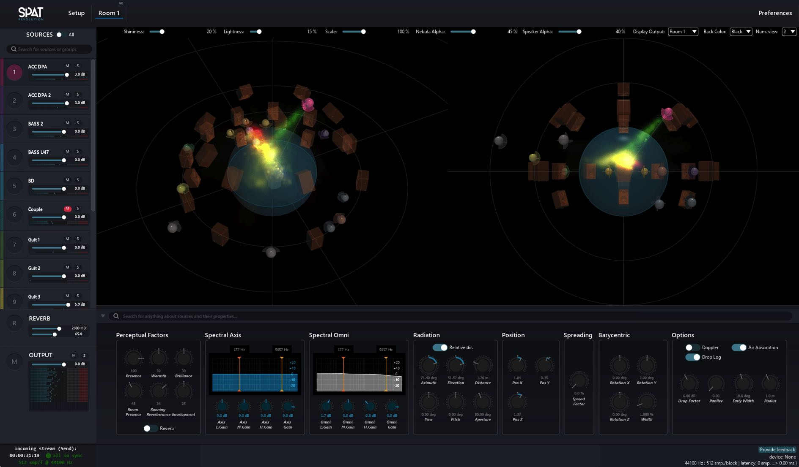

# 4.1 An Overview

The Spat Revolution production environment is based around five graphical user
interfaces that you will focus on at different stages of a spatialisation project.

**Environment Setup**

- Signal Routing, Format Transcoding, Panning Algorithms

**Speaker Configuration**

- Sound system modelling

**Virtual Rooms**

- Dynamic control, Spatial positioning, Scene Visualisation, Mixing

**Source Parameters**

- Perceptual sound design

**Reverberation Parameters**

- Perceptual sound design for artificial reverberation

We will go through each of these areas in more detail in section 6. But first, let us
start with a couple of broad workflow concepts involved in the production of digital audio for immersive sound - **rendering and diffusion.**

> **Virtual scenes are rendered as graphics**
> **on a monitor screen as sounds in a**
> **physical space and as stems to disk.**

Spat Revolution gives you an unprecedented level of control over the position and
characteristics of virtual sound sources placed in virtual spaces. This is the main
function of the **Virtual Rooms** editor where you can adjust and visualise the position and acoustic characteristics of virtual sound sources and compose virtual
scenes with them on screen.

