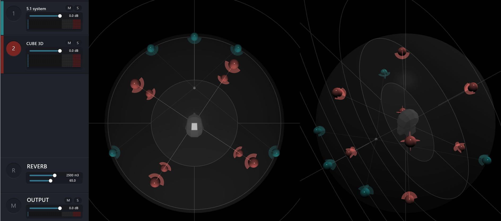

# 4.3 Virtual and Real Diffusion

Successful diffusion of a sound field in space relies on every loudspeaker being assigned correctly to each software rendered output channel.

A diffusion system could range from a simple pair of headphones to a 64 speaker
array and anything in-between. In some of the more virtualised workflows of Spat
Revolution, you may even be thinking about diffusion in a virtual space on configurations of virtual speaker arrangements and channel based formats. The same rule
for successful diffusion applies here - the diffusion in the virtual room will be compromised and sound off, if the channel assignments to the virtual systems are incorrect.

In the above illustration a virtual 5.1 and a virtual Cube arrangement exist together
in a High Order Ambisonic Room, which may eventually be rendered to some other channel based end format.

