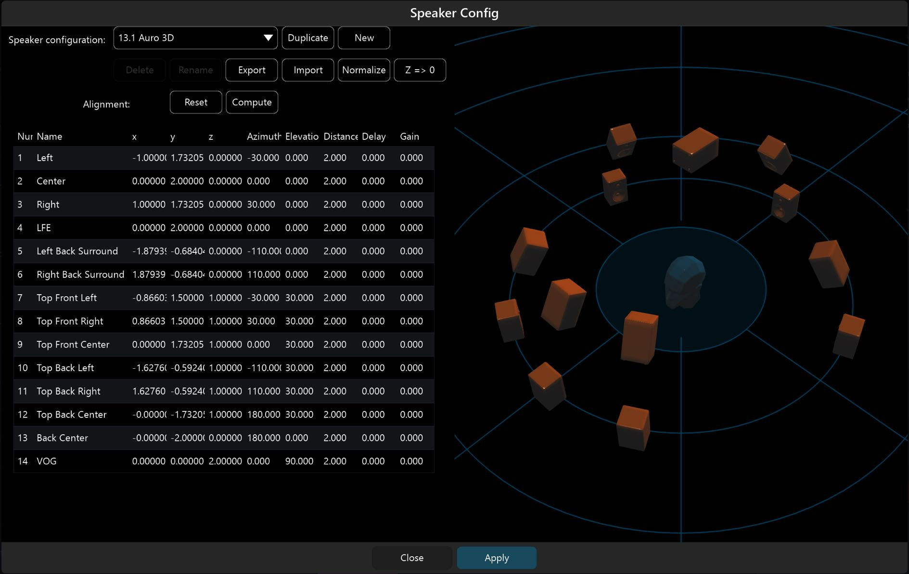

# 4.4 Routing Matrix

As you can imagine routing and patching high density channel counts can get
complicated, especially when setup time is a critical factor. When it comes to that
on location, in a virtual space or in the studio, the SPAT routing matrix is there to
help. You will find it at many points throughout the **Environment Setup** graph.

In a real setup, the channel based outputs from SPAT can be patched to their corresponding speakers by simply clicking around a Matrix and routing the correct
signal to the correct output. In a virtual sound system, or when channels need to be
remapped, the Matrix will be an invaluable workflow tool. We have found it to be
much less complicated than trying to handle virtual cables on screen.

!> Avoid cable swapping on the loudspeaker setup, use software routing instead

> **Spat Revolution simplifies**
> **multichannel configuration in real and**
> **virtual spaces.**

The speaker configuration editor, clear channel labelling and the built-in routing
matrix system all help to make the process of signal routing, checking and debugging more straight-forward on location, 
in the virtual mix and in the studio.

