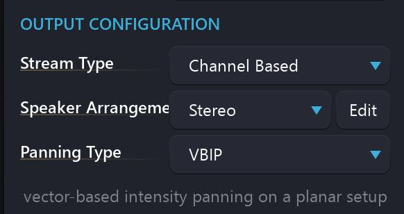
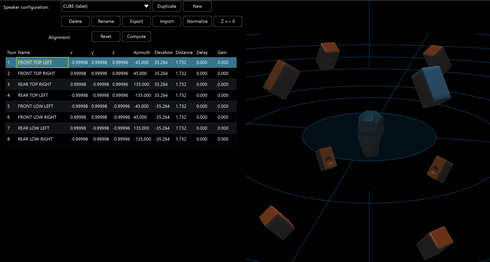

# Channel Based Streams

Spat Revolution is setup to work with a number of different Input and Output formats. The different IO configurations are represented throughout the _Environment Setup_ as _Stream Types_.

We have already covered the two-channels Binaural stream type for monitoring and final encoding into Binaural format. One of the other important Stream Types is referred to as _Channel Based_. This stream can range from a single channel mono to a multichannel audio stream of up to 64 signals which flows as a perfectly synchronised group through the signal graph defined in the _Environment Setup_. The channel count of the stream is set by the choice in the _Speaker Arrangement_ pull down menu of a module. A change to the speaker configuration here alters the channel count in and out of a module, depending on its context in the signal graph. When you connect Channel Based modules together in SPAT they automatically inherit the Speaker Arrangement and Channel Count from the stream type at their connected input.

Channel Based audio streams - when connected to a hardware Output module will render the spatial composition on speakers connected to the physical outputs of your audio hardware. SPAT is expecting the loudspeaker system specified in the Speaker Arrangement of the Output module. If the real loudspeaker arrangement does not correctly match the speaker arrangement model or there is a mistake in your routing somewhere, then the spatial sound image will be compromised.

!> Each output channel must be routed to the correct speaker.

The golden rule for spatialisation using Channel Based audio is that each rendered channel must be connected only to its corresponding sound emitter in the destination system. An exact correlation from the model to the physical system is assumed by the calculations inside each of the panning algorithms. If the installation is not right for some reason, a listener may experience something with spatial aspects, but not with the intended quality. To correctly install and tune a multichannel sound system is one of the more challenging aspects of working with spatial composition and performance systems. So many things can compromise the spatial image, and sometimes it's hard to tell by ears.

In order to try and simplify this process in practice, certain labelling conventions are used by engineers and designers to identify which speaker belongs to which channel. When channel counts are high, angular positioning and distance measurements are used to identify the correct speaker routing. In Spat Revolution's _Speaker Configuration_ editor, you additionally get a 3D graphical rendering of the sound system, where you can select speakers which will be visually identified so you can label them clearly. These labels will be saved into a speaker arrangement profile, so you can get some more consistent reference points when routing.

 
Left | Centre | Right
--- | --- | ---
Left Surround | LFE | Right Surround
Left Back Surround | Center Back Surround | Right Back Surround
Top Back Left | Top Front Center | Top Back Right
Left Surround Rear | VOG | Right Surround Rear
Top Front Left | Back Center | Top Front Left

> Some common Speaker Channel naming conventions

The process of matching the correct channel to the correct speaker is absolutely vital to the successful rendering of the spatial composition from a SPAT _Virtual Room_ into a physical space. Further critical points to a successful project are the choice of panning type in a _Virtual Room_ and consideration of _the sweet spot_ for listener positioning. As it is such an important and often misunderstood idea, let's take a look at that topic before going further.

