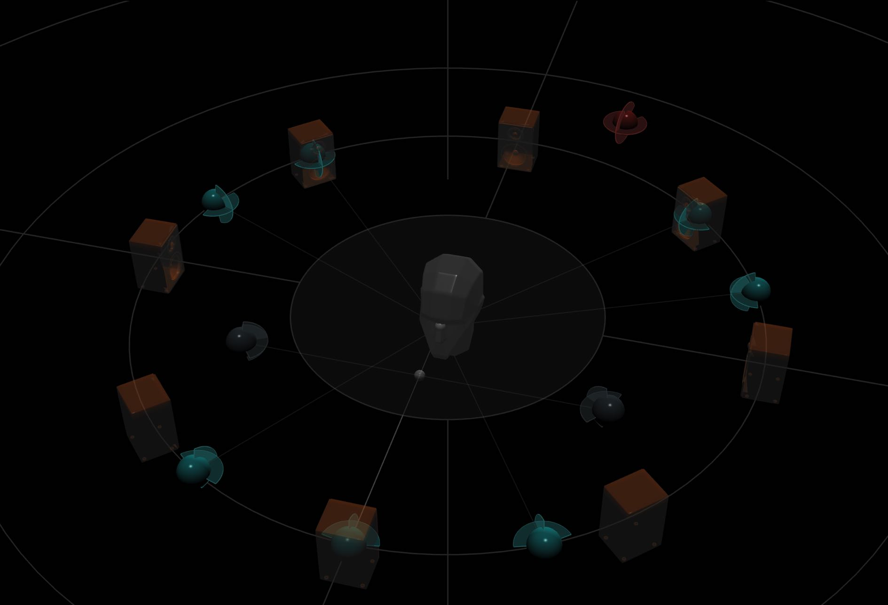
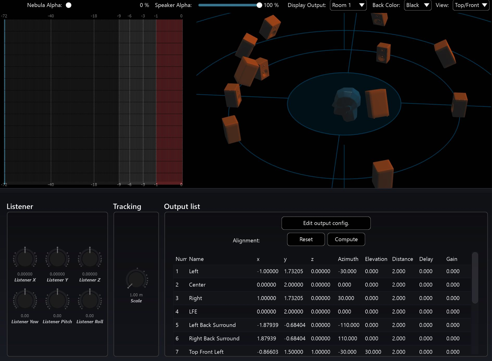

# Listener Position

The impression of positioned audio which is rendered on a speaker array is generally successful when a listener is situated in the optimum position to perceive it the so-called _Sweet Spot_. Thanks to the popularity of stereo sound, people tend to know that if you want to hear a good a stereo image, you should place yourself in front of the two speakers and stand somewhere in the middle. That's a good way to describe the _Sweet Spot_ to an audience or client. In more complex speaker arrangements the _Sweet Spot_ is usually considered to be the area that all the speakers (or sound emitters in a virtual space) are pointing to. It has the cartesian coordinates of (0,0,0) in relation to the speaker positions. In Spat Revolution the optimum listening area is represented by the dummy head and the inner circle that surrounds it.

The dummy head indicates the _Listener Position_. In SPAT the _Listener Position_ is actually a bit more useful than just an indication of the Sweet Spot. In general it is useful for getting some bearings in the spatial composition. Knowing which direction the listener position is facing, helps you understand the spatial image and place sources correctly. For example, a train audibly approaches from the left in an ambisonic field recording you are working with as a source, but it visually approaches from the right on the video footage you are editing to. You can use the listener position as a reference point to transform the field recording correctly so that it correlates to what's happening on screen. Also, when working in 'stage' oriented spaces, the listener position in a SPAT Room will help you compose a scene with the correct relationship to the front, back and sides of the space. It also provides a method for giving a sense of distance to a sound source by placing virtual sound objects closer or farther away from the listening position. The internal distance perceptual cues, such as air absorption, doppler and gain drop are all calculated in relation to the _Listener Position_.

> Some Panning and Stream Types have wider Sweet Spots than others and some do not have a Sweet Spot at all.

It is worth noting that there are some panning algorithms in SPAT that are **not** _Sweet Spot_ dependent. These are more suitable for use on arbitrarily positioned speaker distributions. We will get to them shortly.

!> The dummy head is only visible for sweet spot dependent panning types.

> The Listener Position can be moved in a Spat Revolution room.

In certain advanced situations which might combine position tracking systems with realtime binaural audio it is even possible to transform the _Listener Position_ in SPAT. One application of this might be to give the sensation of getting closer to a sound emitter inside a virtual scene for a headset wearing participant at an interactive VR installation.
