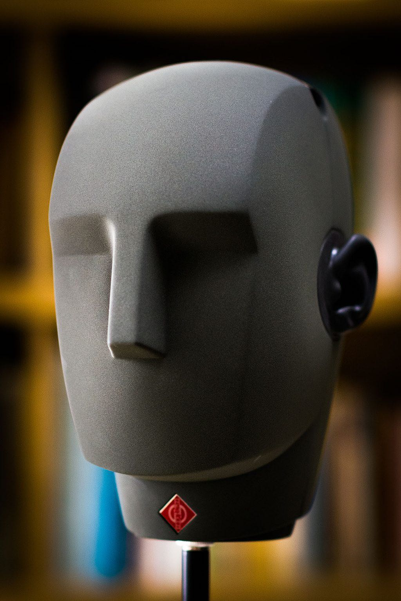

# Spatialisation Technology

In SPAT Revolution multiple 3D-spatialisation technologies can be combined and mixed in different formats and rendered simultaneously. Let's start with an important notion of spatial audio: the listener position.

