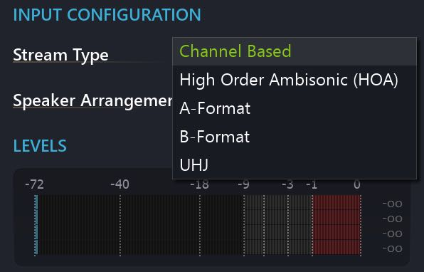

# Inputs

It might be self-evident, but it's worth pointing out that Spat Revolution itself dœs not play audio files. It handles the spatialisation and rendering of signal sources routed through it in realtime like some kind of vast spatial sound mixing console.

The top row of the signal graph represents the input sources that will provide the source content for the current project. You add an input module using the (+) icon, and you can remove ones you don't need with the 'Remove Selected' action. The input streams can be of many different formats, the choice of assignable formats will depend on the number of channels each input module represents.

> One Input module can represent any number of audio channels

The second important distinction between inputs, is whether or not it is a **hardware** input receiving an audio stream from a hardware device or a virtual **send** receiving its audio stream from another program currently running on the same machine as SPAT. The latter is done via a Spat Revolution _SEND_ plug-in - but before we go into Spat's powerful software signal routing integration, let's focus on the different input formats as these will remain consistent whether the input stream is coming from hardware or from a _SEND_ plug-in.

## Input naming

There are two ways to rename an input. The first solution is to simply select an input in the setup page and to rename it in the inspector on the right side of the Spat Revolution window.

If multiple input need to be renamed, the previous method can be tedious. The solution is to select multiple inputs blocs and to choose the option "Edit Inputs Names" in the inspector, or use the shortcut <code>Alt + N </code>. A new window will open with a list of all the selected inputs, ready to be renamed. To quickly navigate through the input names we can use either the "enter" or "tab" key.

## Mono Input

A one channel audio stream is always treated as a Mono signal. It will appear in a _Virtual Room_ as one positionable virtual source with its own directivity and parameters. In many ways, Mono signals are the most straight forward format to work with in a spatial composition. This is because a one channel signal discretely contains all its acoustic and spectral properties without inter-channel dependencies, such as those found in a wide stereo image for example. In practice, such point sources are easier to localise and balance spatially with others.

> Mono sources are simple to work with when balancing a spatial mix

## Two Channel

A two channel audio stream will appear in the _Virtual Room_ as two mono sources linked together as a group. A two channel audio input will already open a few more choices for disambiguating the configuration. Spat needs to know what format the two channels are in, so it knows how to correctly handle the audio stream later in the signal flow.

- **Channel Based**
    Treated as Normal stereo
- **Mid-Side (MS)**
    Treated as Mid Side encoded stereo
- **Binaural / Transaural**
    Treated as encoded 3D stereo

## Four Channel Input

The next significant channel count that needs disambiguation from the user, is a
four channel stream.

A four channel stream could contain the format of a four speaker Channel Based formats (QUAD, 4.0, LCRS) but could also contain different formats of interleaved four-channels Ambisonic audio (A-Format, B-Format). You can read more about AFormat and B-Format in the [Ambisonics](Scene_based_streams.md) section of this user guide. The important thing to remember here is that confusing Ambisonic audio and Channel Based audio is a significant mistake, even though you might hear
something 'wide sounding'.

!> Do not confuse multi-channels based audio formats with multi-channel Ambisonic audio formats. 
They may have the same channel counts but are completely different!

## Multi-Channel Based Input

Any input module configured to represent a stream of multi-channels audio can be configured as a Speaker Arrangement format which would require that amount of channels, as a minimum. For example, _DTU 7.1_ needs 8 channels, and _DTU 5.1_ needs 6. _Auro3D 13.1_ needs 14 channels. Unfortunately things can get complicated in practice, as there are a few variations of standardised speaker layouts which have the same number of channels and seem very similar - but need disambiguation. This is important to get right, and will depend a lot on the context of your
project and on changing standards in the audio industry. For example, at least four different 7.1 routing standards are to be found 'in the wild' and its important to know which one you are actually dealing with. Often, for example, the so-called 'Low Frequency Effects' channel in cinema surround formats, is not always on the same channel.

> ★ Try to stick to industry standard channel naming conventions
throughout a cinematic surround sound project.

L | C | R
---|---|---
sL | | sR
surround Left | | surround Right
  | LFE |
  | Low Frequency Effects |
sbL | | sbR
surround back Left | | surround back Right

> * Some common Speaker Channel naming abbreviations.

Please refer to Appendix C for special information about handling LFE and Mono Sub Woofer routing in Channel Based applications.

## Multi-Channel Ambisonic Inputs

As we have mentioned a few times already, High Order Ambisonics is a technology that encodes sound sources along with full sphere positional information, as complex interleaved audio files that need decoding before they can be listened to on speakers. The lowest order of 3D Ambisonics requires 4 channels, conventionally named as:

- **W** (mono sum)
- **X** (X axis information)
- **Y** (Y axis information)
- **Z** (Elevation information)

This is the conventional _B-Format_ also known as _First Order Ambisonics_. Some Ambisonic microphones record into a very similar four-channel format called AFormat, which ideally needs transcoding into B-Format. You can use the Input Transcoder Module to do that (see next section). There are a number of options that some Ambisonic encoders set differently to others, and these are sometimes concerned with the actual order of the WXYZ - for example a format called **Ambix** has a different order of channels that carry the spherical components, compared to
**FuMa**. It is possible to configure channel sorting and normalisation options in the Input and Input Transcoder modules, and at any point where Ambisonic streams are decoded to a channel based stream. Please contact Flux:: support if you need expert guidance in the area of Ambisonic decoding options, as the topic is very large, and is beyond the scope of this guide.

High Order Ambisonics (HOA) needs more channels to contain the complex interleaved Ambisonic domain information. High Orders encode and decode into sharper and more accurate spatial information as the Order gets higher - but the number of channels needed to hold all the 'spherical harmonics' along with the serious computation involved, becomes very complicated very quickly.
Fortunately....

> Spat Revolution makes it easy to work with High Order Ambisonics.

Just dial up the Higher Orders using the pulldown menu of an Ambisonic Input
module, Transcoder or Ambisonic Room. The output stream will then expand its
channels internally to accommodate the higher channel count needed.
3D full sphere HOA channel counts are defined by the function (n+1)^2 (where
n = Ambisonic Order).

- 1st Order 3D -> 4 Channels
- 2nd Order 3D -> 9 Channels
- 3rd Order 3D -> 16 Channels
- 4th Order 3D -> 25 Channels
- 5th Order 3D -> 36 Channels
- 6th Order 3D -> 49 Channels
- 7th Order 3D -> 64 Channels

_B-Format_ can also be encoded without elevation - this is called 2D horizontal and
is quite suitable for decoding to configurations that do not have speakers on elevated planes. The 2 dimensional Ambisonics data is encoded in multichannel files
with a channel count defined by the function 2n+1

- 1st Order 2D -> 4 Channels
- 2nd Order 2D -> 5 Channels
- 3rd Order 2D -> 7 Channels
- 4th Order 2D -> 9 Channels
- 5th Order 2D -> 11 Channels
- 6th Order 2D -> 13 Channels
- 7th Order 2D -> 15 Channels
