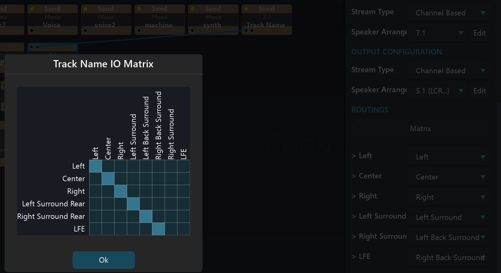
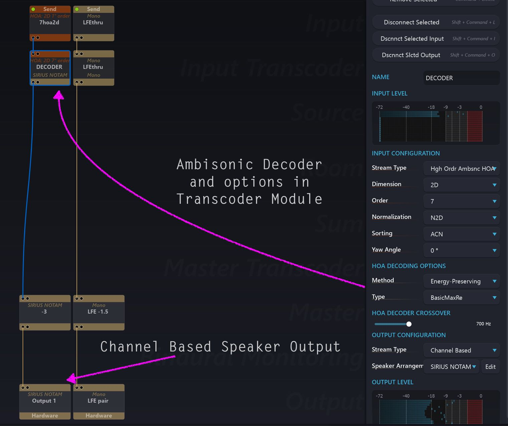

# Input Transcoder

Spat Revolution can handle many different formats of multichannel audio throughout the signal flow, as we have been pointing out. As we approach the actual virtualisation of inputs into object based audio sources in the Spat _Virtual Rooms_ it may be necessary to change from the original input format to another. You use the Input Transcoder module and its parameters to do this.

Transcoder modules may modify the channel count of the stream passing through it, depending on the format transfer being requested. For example, transcoding from Ambisonic B-Format into a Channel Based 3D Cube involves a four channel Ambisonics stream getting transcoded into an eight channel stream grouped and
treated as a specific speaker configuration.

## Transcoding Matrix

In the case where an incoming Channel Based stream needs transcoding into an outgoing Channel Based stream which has less channels, the IO Matrix is used to re-map the output format by dropping some of the input channels. This is not strictly _Transcoding_ or _decoding_ but is a useful tool to have in certain format changing scenarios. This matrix does not give the possibility to up-mix or down-mix. To properly up mix or down mix, it is advisable to use a room to take the virtual source of one format, and output with the desired end format.

## When to Transcode Inputs?

The main reason you will need to transcode inputs is when you are mixing and spatialising inputs in a Spat _Virtual Room_. This is because the _Virtual Room_ module requires incoming sources to be in a Channel Based format. Internally, the Room may well be panning in Channel based, Ambisonics or binaural format, but it always needs Channel Based streams as inputs. More about this in the _Virtual Room_ section. Format transcoding may not always need re-spatialising in a Room. There are some contexts where you will not use a Virtual Room in the signal flow,

Here is an example of decoding an Ambisonics signal using an Input Transcoder module. This could also be done in the Master Transcoder section of the graph.

As mentioned in [Introduction to Ambisonics](Scene_based_streams.md?id=introduction-to-ambisonics) a decoding stage is absolutely necessary to
render Ambisonics encoded audio to speakers. It can be done like this without the need of a room.
