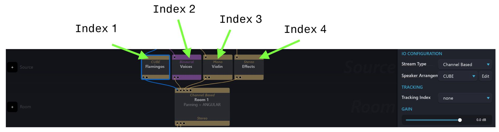
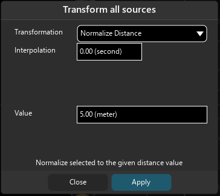
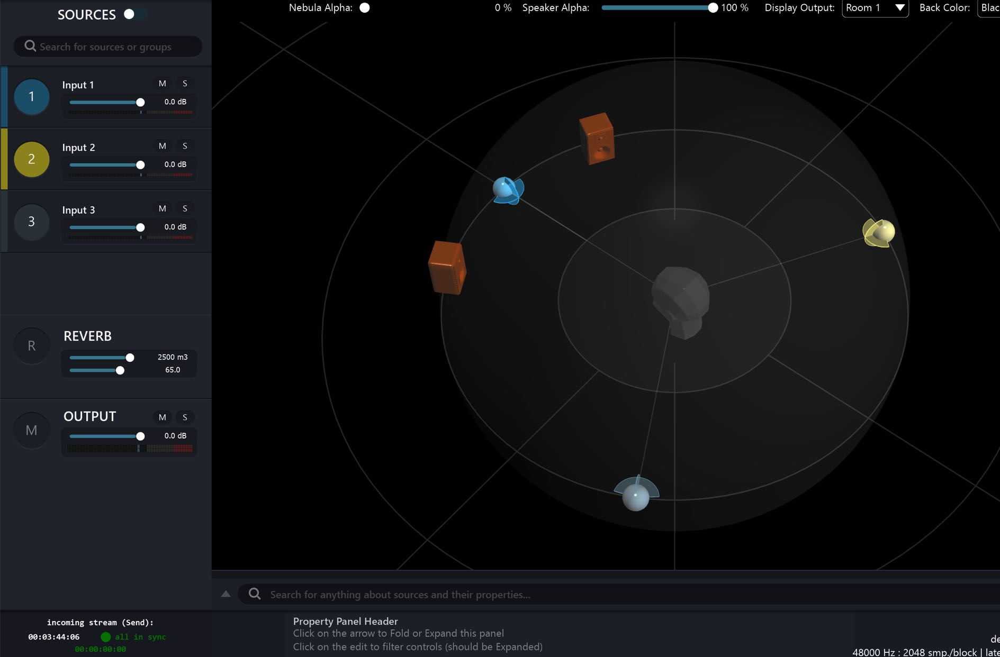
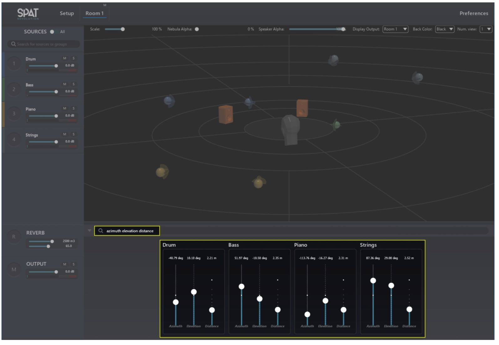
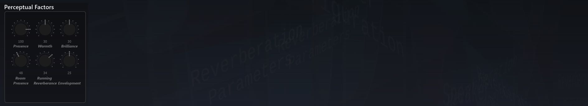
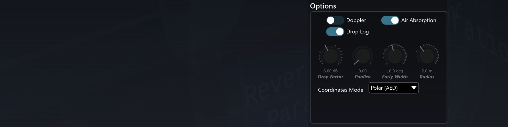

# Source

The next row transforms the inputs into virtual objects according to their configuration. This is what needs to happen so that a virtual Source appears in a virtual room. If you try to connect an input directly into a Room, Spat will always put a Source module in-between.

The Source modules are where you set a descriptive Name of each virtual object. It's a good idea to do that, as things can get busy inside the Rooms. You can also adjust the overall gain of a Source here no matter how many channels it might have. The Source modules are also important for parameter automation using the _Spat Send_ plug-in, and also in the case of external OSC control.

External software needs to know how to identify virtual objects, and that will done using an Index number rather than a name. This Index number refers to one of these Source modules, numbered from left to right which in turn, becomes a Virtual sound emitting object in the _Virtual Room_. When working in a Channel Based Room outputting to an _n.1 surround_ speaker arrangement, each source will additionally acquire an individual _LFE Send_. This dial will be available in the Source Parameters inside the Virtual Room editor, and also mirrored here as a fader directly in the Source modules. _LFE Send_ controls how much of this source's signal is mixed into the LFE channel at the output.

> When using a BlackTrax positional tracking system a Tracking index can be assigned to a virtual source directly from the Source module.

## Tracking

Spat Revolution is able to receive data from RTTrPM open protocol tracking systems. Currently, BlackTrax™ is supported natively. BlackTrax™ is a vision-based system that connects to different third party applications, such as robotic lights, media servers and Spat Revolution.

When you have correctly setup the BlackTrax protocol (see [BlackTrax Integration section](ThirdParty_BlackTrax.md)) then you can directly assign Tracking Index to virtual sources, and also to listener position (see [Listener position section](5_Spatialisation_Technology_5_4_Listener_Position.md)) for advanced virtual reality interactive audio projects.

## Sources Transformations

As with the custom speaker arrangement editor, we can apply some transformations to one or multiple sources. This feature is especially handy if you wish to quickly set sources on a circle, or to put a selection of sources at the distance for examples.

To open the transform menu, right click on a source in the source panel and choose "Transform". You can also use the shortcut <code>CMD/CTRL + SHIFT + T</code>.

Please check the section about [Speaker Arrangement](Spatialisation_technology_Speaker_Arrangement.md) if you want more details about the different transforms.
Sources transformations also include an integration time which allow to create smooth transition between the current and the new sources position.

## Source Parameters

Every virtual source in a Room has its own set of variable parameters which define its simulated positional information, psycho acoustic properties, virtual acoustic properties and other options.

To edit the variables of a source in the _Source Parameter_ editor, you must first be inside a Room. Select the source you want to edit from the list on the left side panel of the Room editor by left clicking on its Index number. Alternatively, grab its 'emitter' object in the 3D Room visualisation (or just one of them, if the source is a multichannel group). When you select a source, the _Source Parameter_ editor will pop up as a set of categorised groups with which you can alter the properties of the Virtual Source in the Room.

Additionally, a _right click_ on a Source Index number will bring up some further options, especially useful is the **Colour** option, which allows you to set an identification colour to a Source or Group.

### Defaults

A double-click on any Source Parameter dial will reset it to a Spat default setting. The default setting of a parameter is indicated around a dial as a larger tick than the other tick marks. Additionally, a range is graphically indicated between the default setting and the current setting of a variable parameter.

> ★ _Use the defaults as points of reference in your spatial sound design._

### Preset Memories

Each parameter has the possibility to store useful preset settings of your own choosing. Right click on a parameter dial, and a contextual menu will pop up. From there you can store the current setting to a Memory Slot, or Recall a setting from a previously saved memory slot.

### Multiple Source Selection

You can shift-click on the Index number of separate Sources to create an ad-hoc edit group. When you have group Sources in this way, you can perform a number of group edit actions. When you Right Click on an ad-hoc group selection a menu will pop up where you can:

- distribute the sources in the group with the [Transform panel](6_Spat_Environment_6_6_Source_6_6_Source.md?id=sources-transformations)
- generate different colours for the sources
- reset the positions of the group

When you have selected an ad-hoc group using the shift-click technique, you can then pop-up the _Source Parameter_ panel by clicking on the property panel header 'fold arrow' as shown in the screenshot below.

Any Source Parameter variables you adjust manually will assign that same setting on all selected sources in the group. A barycentric will then become practical to work from a center of mass perspective. For example, transformations like scaling, distance, rotation and directivity of the group is managed by Spat controlling each member of the group a barycentric relationship. Consider referring to section [Barycentric groups](6_Spat_Environment_6_8_Barycentric_Groups_in_Rooms.md) about groups in Rooms to read more about how they are represented.

### Smart Property Filter

This feature allows you to display one or several parameters for all the sources that are in the same Room. It is a useful feature for fast editing. Type "azimuth elevation distance" in the filter box for example, and you will see faders appear for only these properties, grouped for each of the sources as demonstrated in the following screenshot.

### Perceptual Factors

This parameter group holds settings affecting the way the sources direct and reverberated acoustic properties are perceived by the listener.

As touched on previously, these are not simply names stuck onto a single internal parameter dictated by the inner workings of the algorithm. Instead, a true perceptually-oriented approach is used in the design, where a test panel of listeners is presented with a test-set of sounds, constructed from several different variations of the reverb engine inner parameters. The listeners are then asked to rate each set onto a few different scales with perceptually and aesthetically meaningful names. Using principal components analysis (PCA) and optimisation techniques, we then built an algorithm which reverses the process and automatically maps a given set of perceptual factor values to the many internal reverb engine parameters.

As a general guideline, we encourage you to learn the meaning of these parameters by carefully listening to the audible characteristics when adjusting them. We do provide a short explanation of each of them below, but training your ears is really the best way to be able to use these in context.

**Presence**

Source presence refers to the prominence of the direct sound with respect to the reverberated sound. It is not just equivalent to a dry/wet ratio, and is influenced by

other settings such as distance, radius and drop-factor.

**Warmth**

Presence of the low frequency content part of the source.

**Brillance**

Presence of the high frequency content part of the source.

**Room Presence**

Prominence of the reverberation with respect to the source, or in other words, how much the room sound dominates the overall sound.

**Running Reverberance**

This parameter controls the amount of perceived reverb when feeding a continuous music message, where the overall sound is a tight blend of the dry and wet signals and the reverb part cannot be mentally separated. It is linked to the early reflections decay time of the Spat Revolution Reverb engine. Note: this setting is not the same as the ‘reverberance’ in the _Reverb Properties_.

**Envelopment**

Envelopment corresponds to the perceived notion of how much the listener feels that they are surrounded or immersed by the ambient sound. In a multichannel configuration, one could describe this as the feeling of being wrapped inside the imaginary “sound sphere” that the listener pictures in her mind. It can also be described as the energy of the early room effect with respect to direct sound.

### Reverb Options

**Reverb Enabled**

Toggles whether a source will use the reverberation engine.

**Early / Cluster / Tail**

Toggle whether a source will use only some or all of the different reverberation stages.

_Early_ refers to _Early Reflections_ stage of the Room response which is one of the most significant stages involved in our rapid aural perception of spatial properties and sound source localisation.

_Cluster_ refers to a secondary iteration of room response reflections and is quite significant in the cognition of room acoustics.

_Tail_ refers to the diffuse reverberations that eventually decay in a direct relationship with the size and reflectivity of an acoustic space. The tail section of a reverb dœs not contribute much to the localisability of a sound source in a space, but instead gives a sense of depth and ambiance.

### Axis / Omni Filters

These two spectral processors can be considered as being equalisers that have been especially designed for virtual sound emitters simulated in virtual spaces.

**Spectral Omni**

This filter section is for equalising the omni-directional part of the sound radiated
by the virtual source. This equalizer mimics the global frequency response of the
source, similar to how a loudspeaker colours the sound.

**Spectral Axis**

This filter section is for equalising the on-axis part of the sound radiated by the virtual source. Most, if not all commercially available loudspeakers do exhibit a radically different frequency response whether a listener or microphone is right in front of it or to the side.

Setting a rather flat on-axis equalizer curve, and maybe cutting the treble and mids for the omni response would be a good starting point to emulate a real-world speaker, so this is the default setting for these filters.

> **_Spectral Axis_** **performs more like conventional mixer EQ**

### Radiation

This section controls the simulation of acoustic radiation in relation to the location and emitter orientation of the virtual source. Use these parameters to simulate how a source will interact inside the reverberant environment.

**Relative Direction**

This switch is a very simple way for a user to achieve a more consistent result as regards the natural conservation of a source's presence. The algorithm will continuously maintain the on-axis focus for each virtual source - or for every emitter in a grouped source - so that it is consistently oriented towards the listener position. When not engaged, a source remains in the same constant direction which is what might be preferred if something is passing through in a spatial design.

**Distance**

Distance from the source to the center reference point (listener position), in meters.

**Azimuth**

Angle between the source location and the listener position front reference axis, in degrees.

**Elevation**

Elevation angle, in degrees.

**Yaw**

Angle of the source direct orientation relative to the listener-source axis, in degrees.

**Pitch**

Source direct orientation pitch angle, in degrees. Think of _pitch_ in the nautical sense of the word, how a boat _pitches_ up and down in stormy seas.

> **Pitch and Yaw can be used to make a source more diffuse
by turning its direct sound away from the listener**

**Aperture**

The aperture parameter relates to the “sound cone” projected by the virtual source in the acoustic space, and is measured in degrees. It determines whether the source will be very directive (small aperture), or omnidirectional (large aperture) inside the reverberant environment.

> **Aperture can make a source 'activate' more of the acoustic
space**

### Send LFE

This variable parameter will only be available when the room is a Channel Based Format which features an LFE speaker in its configuration, such as DTU7.1 / 5.1 / AURO and ATMOS for example.

It will send an amount of the source into the dedicated LFE speaker channel of the output channel based configuration.

> **Automate the LFE send for dynamic low frequency effects**

### Barycentric

These rotational transformations will only work on a virtual source that consists of more than one emitter in a grouped channel based arrangement. They will also become active, when you _shift-select_ mono sources together to form an ad-hoc group or shift-select mono sources in combination with grouped channel based sources. The 3 dimensional group rotations are calculated using a 'barycentric gravity' method to transform a network of sound sources constrained in a group relationship.

**Rotation XYZ**

Rotate a group cluster around the XYZ axis of their common barycentric pivot point.

**Scale**

Scale the group cluster, maintaining their barycentre and relative relationships.

**Relative Direction**

The barycentric transformations will continue to orient their on-axis energy towards the listener position, if the relative direction algorithm is enabled.

### Options

Finally, there are some options available for each source.

**Doppler**

The Doppler effect is a well-known wave propagation phenomenon where the height of a sound perceived from a listener standpoint rises when the source is accelerating, and falls when decelerating. This is the fire siren pitch going up then down when passing you. It will only be heard if you rapidly move the sources locations quite fast, but thanks to the virtual nature of the Spat, you can bypass Physics’ laws and manually inhibit it using this switch, should it be unsuitable for the particular application you are dealing with.

**Air Absorption**

Simulates the frequency-dependent absorption of air, where high frequencies rolloff quicker than low-frequencies with respect to distance. You have most probably noticed this phenomenon when you are far away from a concert venue and only able to hear the bass, and gradually start to hear the whole mix as you get closer.

**Drop Factor and Drop Log**

Owing to a fundamental law of acoustics and geometry - namely energy conservation - sound pressure drops in level as one moves away from the source. Enable _Drop Log_ for an acoustically accurate setting, which corresponds to a drop value attenuation every time the distance from the source is doubled (logarithmic behaviour). The default _Drop Factor_ of 6db is also the acoustically accurate setting.

**Radius**

Specifies the radius of a sphere or disc in meters, centered around the listener position, where the drop attenuation is not taken into account, and the sound level is kept constant with regards to distance. This is not only useful to prevent any dramatic sound level peak when placing a source too close to the listener, it also reflects real-world behaviour quite accurately, where sources do have a certain physical size, unlike point sources that are commonly used to model far-field acoustics. This “no-drop” zone is displayed as a transparent sphere of matching radius in the Room graphics.

**PanRev**

By default, only early reflections are panned, and the cluster reflections, which form the diffuse part of the early reverberation, are panned dead center. _PanRev_ allows you to modify cluster panning, thus imparting some directionality or perceived direction to the diffuse part of the sound.

**Early Width**

Controls the width of the sound projection lobe of the early reflections from a source in the virtual acoustic space, in degrees. The minimum setting, 1°, gives a very directional source, whereas 180° makes it omni-directional.

### Spreading

**Spread Factor**

Spreading is a percentage factor that defines how a sound source will appear to spread out across speakers or virtual speakers. It is similar to _Aperture_ in its focusing effect but will translate differently across certain channel based speaker arrangements according to how many speakers are involved.

**Nearest Neighbours**

This parameter is only available to a source, if the room it is simulated in has been specified to be using the [_K Nearest Neighbour_ panning type](5_Spatialisation_Technology_5_5_Panning_Algorithms?id=k-nearest-neighbour-knn). It sets a maximum limit to the number of speakers that the algorithm can use as neighbours in its search for speakers to activate in relation to a virtual source. On a 10-speakers setup, 1-10 % will be the closest speaker to source. 11%-20% will be 2, and so forth.
