# Room

In Spat Revolution, spatialisation of virtual sources takes places inside _Virtual Rooms_. To enter a Room and open its graphic editor environment, double-click on a Virtual Room module in the Setup graph, or select a room tab from the Navigation bar.

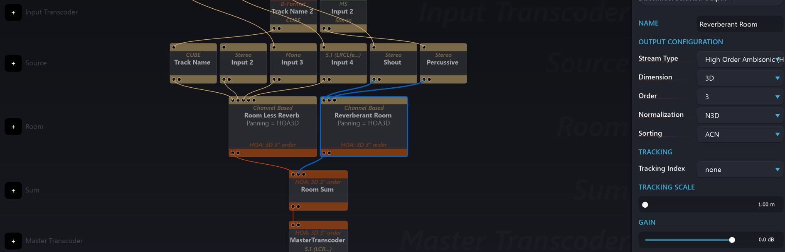

The first thing to notice is that we can add any number of Rooms. In the screenshot above, two HOA 3D rooms are being used, each with differently designed acoustics. There is plenty of flexibility built into Spat Revolution, in order to encompass different workflow ideas or experimental approaches. For example, the same virtual sources may be assigned into multiple rooms, with multiple end destinations. Or as in the screenshot above, virtual sources might exist in different spaces, that get summed together.

When we enter a Virtual Room, we will see the 3D positionable editor. All connected virtual sources will appear on the 3D scene render. On the left side panel of the room editor, you get a list representation of each source with its Index identification number. We can click on the Index number of each source, and the _[source parameters](6_Spat_Environment_6_6_Source_6_6_Source?id=source-parameters.md)_ editor for that virtual source will appear.

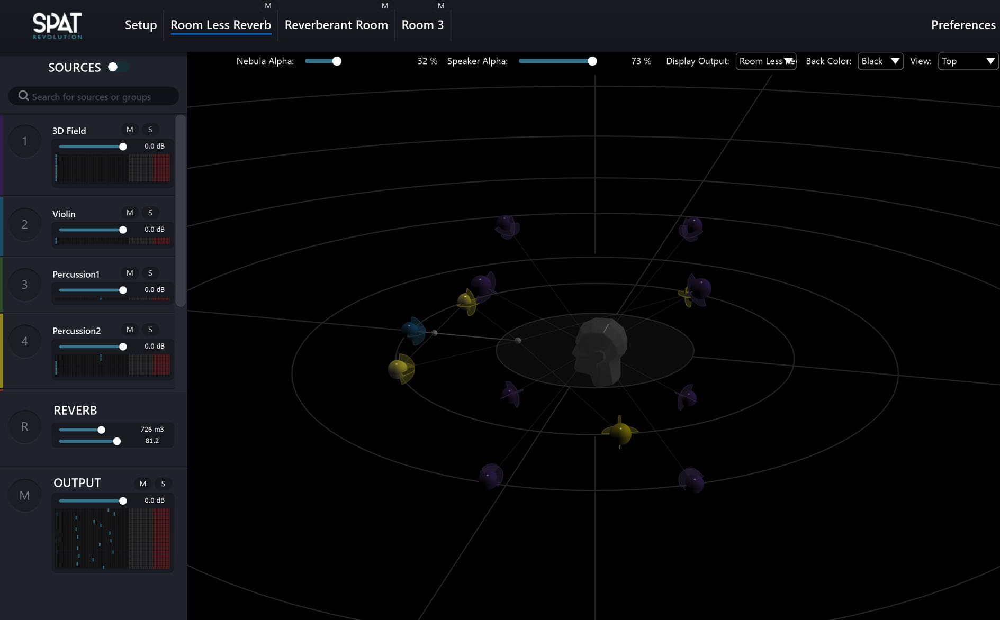

> If a source consists of a configuration of linked emitters, there will be only one index and one set of parameters for the whole cluster.

Two special index items labelled as **(R) REVERB** and **(M) OUTPUT** appear fixed at the bottom of the left panel. By clicking on these, we then enter into two more parameter editors: one relating to the _[Artificial reverberation](8_Artificial_Reverberation_8_Artificial_Reverberation.md)_ and one relating to the Room output configuration and [Listener Position](5_Spatialisation_Technology_5_4_Listener_Position.md) editor.

Mutes and Solos are manageable for all sources and for the entire room output from this index list. When you have more than one Virtual Room in your project, then the SOURCES switch at the top left of a Room editor can be handy, as it will show all Sources from all Virtual Rooms in the same editor - allowing edition, mix, solo and mute management all sources from one Room view.

## Room Graphic Engine

Along with the audio modelling engine, one of Spat's key features is its ability to model a high definition graphical representation of the virtual space inside each Room. We can intuitively interact and move sources and 'camera view' directly with our mouse. Move a source by grabbing its 'emitter' object or in the case of a grouped source grab any one of the emitters that belong to the group. Alternatively, sources can be positioned by manipulating their coordinate related source parameter controls (see [ Radiation section](6_Spat_Environment_6_6_Source_6_6_Source?id=radiation)).

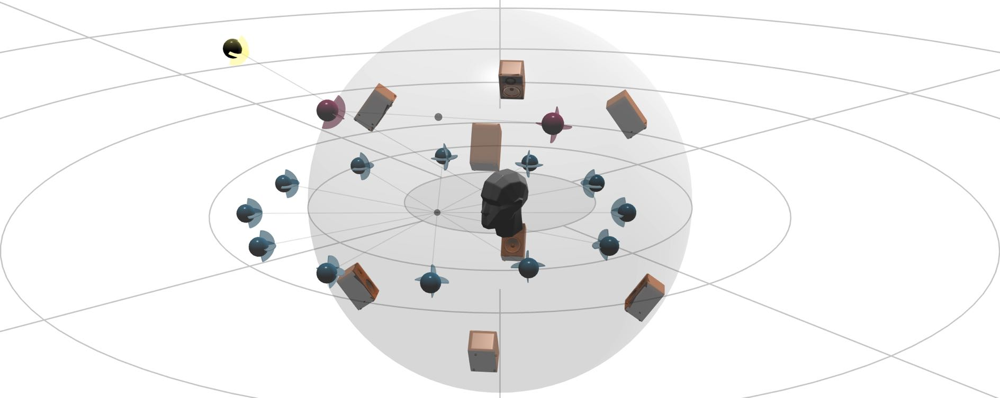

## Room 3D View

The camera angle of the 3D scene can be moved continuously using a **controldrag** mouse or trackpad gesture applied directly onto the Room view. This will reposition the camera. A _forwards and backwards scroll_ on the mouse or trackpad will zoom the camera in and out of the scene. We can also move the 3D view with <code>Shift</code> and a **controldrag** mouse. Furthermore, a change (or resetting) of view orientation can be selected from the _View_ pull down menu, to show 'Top/Down' view of the scene. 

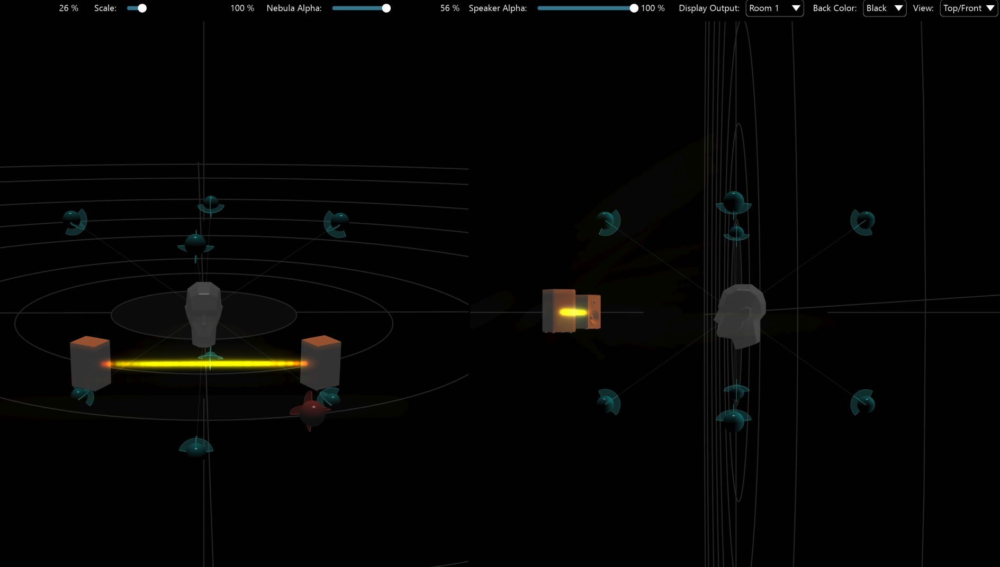

> A split screen Top-Front view is also available.

Selecting a source also display its name over its 3D representation. At the top of the room, there is an option to display the name of the all sources or of all the speaker.

## Room Output Configuration

The _Virtual Room_ module requires all sources to be in some type of Channel Based format at its inputs. Internally however, the Room may calculate spatial positioning and panning using different methods according to the setting of the _Output Configuration_ pull down menu.

A Room will compute internal virtual panning, reverberation and output in five possible formats:

- [**Channel Based**](#Channel-Based-Setup-Examples)
    - Virtualised Sources
    - Virtualised Speakers
    - Virtualised Panning Behaviour
- [**Binaural**](#Binaural-Room)
    - Virtualised Sources
    - Virtualised HRTF
- [**High Order Ambisonic**](#High-Order-Ambisonic-Room)
    - Virtualised Sources
    - Virtualised Ambisonic Encoding
- [**B-Format**](#B-Format-Room)
    - Virtualised Sources
    - Virtualised Ambisonic Encoding
- [**Mid Side**](#Mid-Side-Room)
    - Virtualised MS microphone arrangement

> Different Virtual Room types can be used in parallel.

In the output section, we can also mute specific speaker. This can be really helpful for checking routing or for diagnostic its system.

## Channel Based Setup Examples

If the output configuration is set to **Channel Based**, the user must decide on the appropriate _[Panning Algorithm](5_Spatialisation_Technology_5_5_Panning_Algorithms.md)_ to work with. The loudspeaker array selected in the _Speaker Arrangement_ pull down menu will be 'virtualised' in the Room and all the speakers will appear graphically.

> Speaker Arrangement also defines the number of output channels.

The spatial composition of Virtual Sources is governed in the Virtual Room by the characteristics of the currently selected **Panning Type** and speaker positions. In other words, the _panning type_ is simulated inside the Room on the **Speaker Arrangement** model. **[Artificial reverberation](8_Artificial_Reverberation_8_Artificial_Reverberation.md)** is also modelled in relation to the speaker arrangement in a Channel Based Room.

Additionally, the powerful _Nebula Spatial Spectrogram_ is highly dependent on the virtual speakers model, panning type and simulated acoustics of a Channel Based Room. Let's take a quick a look at _Nebula_ before continuing with the Room types.

## Nebula Spatial Spectrogram

_Nebula_ is a technology adapted from our flagship **FLUX:: Analyzer System**, a suite of highly regarded professional mastering and mixing visualisation tools.

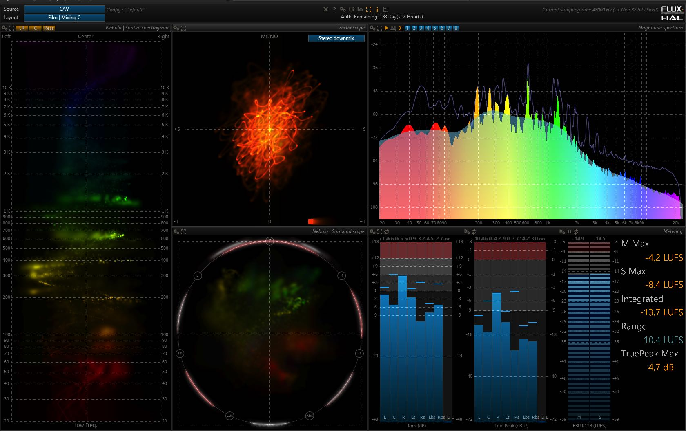

> Screenshot from a Flux Pure Analyzer session.

**Nebula** in Spat Revolution provides a unique representation of the sound field in terms of spectral content and localisation rendered directly inside the 3D speaker simulation and virtual room display. It combines the functionality of a spectrum analyser and a vector scope in a novel real-time display. It is a useful tool to get a realtime overview of your spatial mix in terms of spectral-spatial diffusion, and can give quite accurate representations of 'where' and 'how' sound will manifest over a real world sound system. A lot of work has gone into optimising the real-time rendering of the display, not solely for aesthetic reasons, but because we wanted the display to react instantly to all the details in the incoming multichannel audio. The idea is literally for you to be able to see what the listener will hear and feel.

**How does it work?**

The overall principles behind _Nebula_ are quite straightforward. At any given time, and for every frequency, the engine computes the position of a frequency in space (2D in stereo and 3D for multi channel surround). This position is taken as the center of gravity of the various channels, weighted by the relative amplitude of the signal in their corresponding channel. A colour-intensity mapped projection is computed for the multi-speakers plane, giving a spectrum-space frame constrained to the surround sound field radius or sphere. Past analysis frames are progressively “forgotten”, using blur and dimming, in order to make place for new information, which gives the graphic display increased legibility and its characteristic 'nebulous' quality.

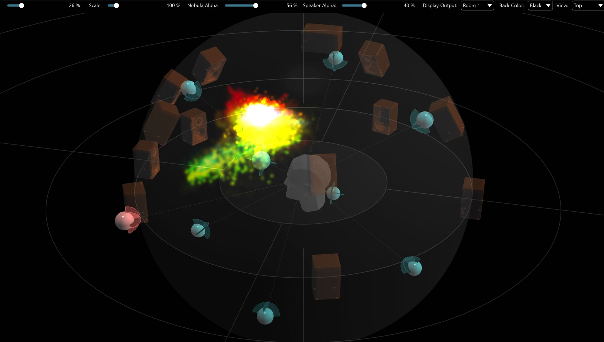
## Virtual Room Concepts

### Simulated Speaker Diffusion

When a Virtual Room is Channel Based, the speaker configuration layout is modelled as fixed speakers which appear in the Room graphically according to their programmed positions (_see [Custom Speaker Configuration](Spatialisation_technology_Speaker_Arrangement.md)_) - you will not be able to move those speakers around with the mouse. These fixed speaker positions are virtualising a sound system configuration which is often the same one that will be used for diffusion. These virtual speakers interact with the virtual acoustics of each Room as designed by the _[artificial reverberation](8_Artificial_Reverberation_8_Artificial_Reverberation.md)_.

> Each room can have a DIFFERENT Virtual Acoustic design and different sources.

The idea is that by simulating speaker positions and acoustic interactions, the process of mixing for a particular speaker layout becomes more predictable. For example, by monitoring binaurally a scene from a channel based room, it is possible to get an impression as to how the mix might sound diffused by a particular speaker arrangement, including the space between speakers and gain characteristics belonging to selected panning types. As we have mentioned earlier in the section about [Ambisonics](Scene_based_streams.md), there are also options for mixing and monitoring a particular Channel Based Room simulation transcoded to a different setup than that being simulated, which may also be useful in certain contexts.

This is really all about mixing. Mixing in stereo is already a significant challenge, some have devoted their entire careers to it. Mixing for multiple speakers is even more complex.

It is advisable to think in parallel as far as room mixing goes. You could think of SPAT Rooms as different kinds of spatial busses with integrated acoustic emulation units. Use them in parallel, send some or all of the sources to multiple Rooms at the same time and sum the outputs together into one output format. One room might have a huge reverb, and one might be a much smaller space. Channel Based Rooms will have different sounds, but they can all be summed into the same channel based format.

In practice, the best mixes are attained by mixing on the same sound system in the studio or venue as you have represented in the Channel Based Rooms. But there is also the possibility of monitoring Channel Based mixing on headphones using the [binaural monitor](5_Spatialisation_Technology_5_1_Binaural_5_1_Binaural?id=binaural-monitoring-module.md) or a dedicated, parallel, binaural room. This is workable enough to allow you to keep on arranging a mix and spatial composition 'off-location' without too many surprises when it comes to the final result.

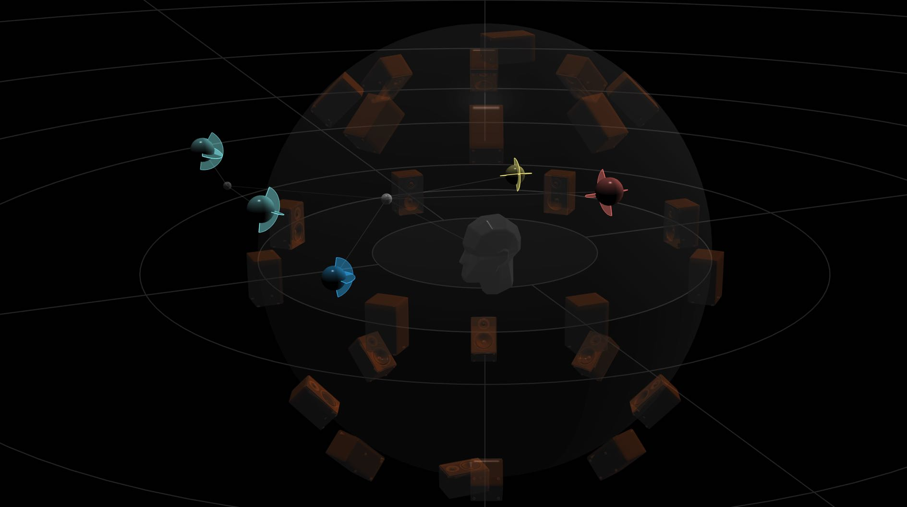

> Channel Based simulations render localisable virtual sources by controlling the virtual speaker array in a similar way that panning-laws do on real world physical systems. They do not model the positions of virtual sound sources, but instead control the gains of the virtual speakers in the model to render perceived positions.

### Multichannel Virtual Sources

All inputs to a Room must be in some kind of Channel Based format, even when the Room is an Ambisonic or Binaural Room. Even a Mono source can be considered as a channel based signal of [one channel](6_Spat_Environment_6_4_Inputs_6_4_Inputs?id=mono-input.md). For any source that has more than one channel, it will be structured as a Channel Based configuration - and that configuration will be virtualised inside the Room as one single source in an inter-connected cluster formation - this is designed to maintain interchannel spatial image relationships as much possible, keeping the multichannel source in a discrete self-contained system. The sound, size and positioning of that configuration can now be manipulated as a unified group.

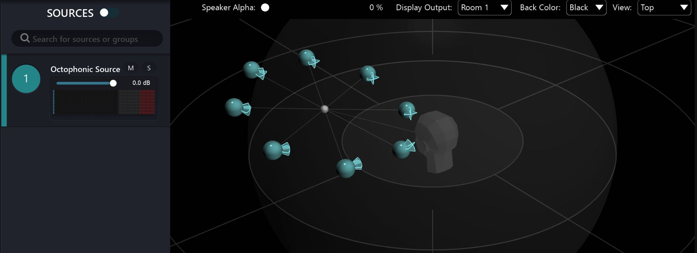

### Speakerless Virtual Rooms - Binaural and Ambisonic

The better alternative to Channel Based simulations is to use a _Binaural_ or _High Order Ambisonic_ room to mix. In these Room simulations, speakers and panning are not simulated. Instead all the inputs into the room become _Virtual Sources_, they become sound emitters in the virtual space. To get a grasp on how mindbending this is, we need to go through it a little.

In a fully virtualised Ambisonic room, the _Nebula Spatial Spectrogram_ will no longer be available, as it is too complicated to compute the spatial-spectra of moving sources. No visualisations of speakers will appear either, as they are not being modelled.

So far, we have established how the audio technology at the heart of SPAT is capable of simulating precisely the emissions of virtual speakers at fixed positions, and the way they interact with virtual acoustic space.

But the real big achievement of SPAT and High Order Ambisonic is the modelling of virtual sound sources that are changing orientation, size and position. SPAT can model these _and_ simulate the changing response of the acoustic space to these complex, dynamic and _imaginary_ sound diffusors.

This is where we touch on what 'virtualisation' of sound sources really means.

The technology of Virtual Sound Systems and Virtual Spaces invites us to stretch our imaginations beyond what is possible on a physical installation and into a place where sound emitters can continuously alter their structural dimensions, orientation and acoustic characteristics - the idea of speakers as fixed objects no longer applies in the virtual acoustic space. Instead, sound emitters grow wings and become complex musical elements to be organised and composed in time and space, contributing even more to the cultural experience of music.

### Upmixing and Downmixing

One workflow that is often required, is that of re-mixing a pre-rendered channel based mix of a particular format, to get that mix expressed into a different channel based format. For example, the need to down mix a 5.1 surround into stereo is quite common, but also the other way - perhaps a 5.1 surround mix needs to be up-mixed to a 7.1.   One way to do this, is to use an Ambisonic Virtual Room as a way to simulate the source configuration as if it were being diffused in a space, in its correct speaker format and with simulated, full sphere acoustics and then transcode the output to the desired format.  

Here is an example of that in the Room view. Notice how it is possible to re-balance and re-mix the original using the perceptual factors or positional parameters. A room simulation reverb is also playing a significant role in the cross-format mixing process, as the reverb simulation adds new spatial information to the mix, which might help get a more immersive result in the output format.

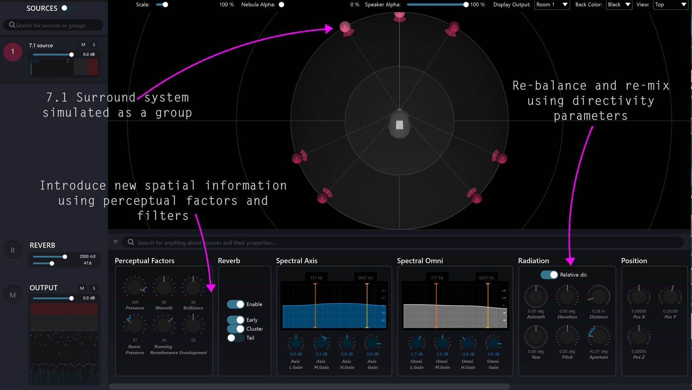

This is an example of a multiple format changing signal graph, which changes format in two ways, to provide an alternative result. Firstly, by transcoding the output of an HOA Room into various other Channel Based formats, but also a room that simulates how the target speaker configuration might render the source speaker configuration. Both methods will give different results and the choice is up to the designer.

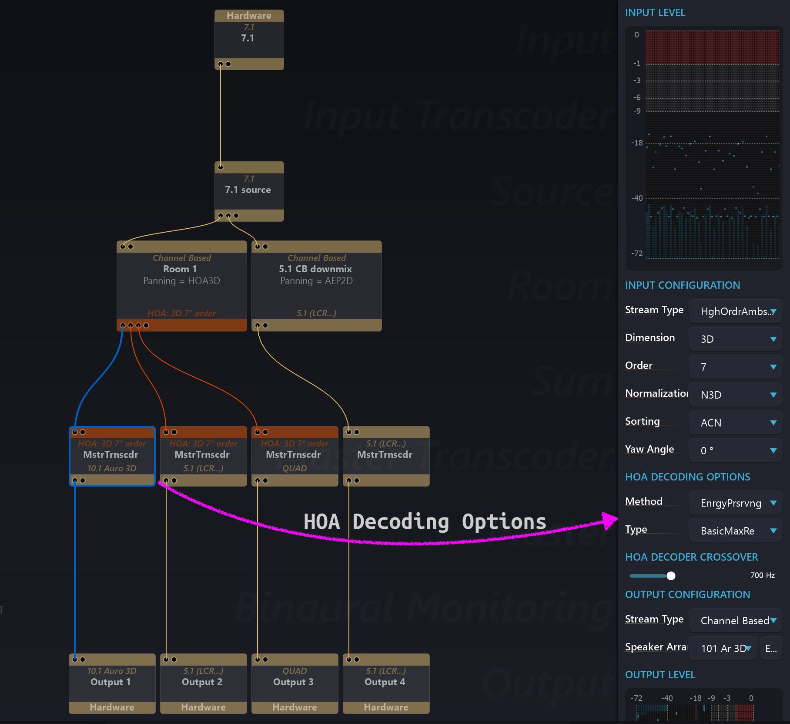

Options are available when _transcoding_ (aka _decoding_ ) from a High Order Ambisonic room into a Channel Based stream. These decoding options will affect the sound in quite different ways - luckily it is possible to listen to the results of different Ambisonic decoding options in realtime. More about this in section about [Ambisonic transcoding](Ambisonic_transcoding.md).

### Virtual Stereo Diffusion and Microphones

When a Virtual Room is set to be Channel Based / Stereo, it will model a stereo speaker system in the virtual room acoustics _and_ virtualise stereo microphones in real-world stereophonic recording configurations. This is a hybrid approach, where you 'record' the sources positioned in the Room through virtual matched pair microphones at the listener position, as if you were miking up a concert for stereo broadcast or playback. The microphone modes were described in section about [XY and AB panning](5_Spatialisation_Technology_5_5_Panning_Algorithms?id=xy-ab.md) and become available under the Panning Type menu of the Room when it is set to Channel Based Stereo.

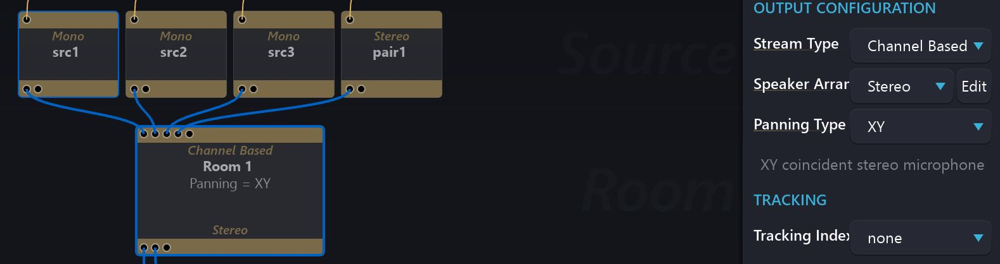

You will notice how the Spat Reverberation handles the stereo image naturally, because it is modelling the entire mix scene in the acoustic context of a Virtual Room, rather than the conventional 'voltage controlled' left-right pan pot that all audio mixers offer for stereo mixing.

This method of working in a stereo Room invites a different approach to stereo panorama source mixing in the studio or on twin stack PA systems. It can also be a way to down mix from a surround format to stereo by simulating the speaker configuration and 'recording' it in stereo.

One final thing to note when working in an Ambisonic room, rather than a channel based room, is that the feeling of **Artificial Reverberation** that gets encoded into the High Order Ambisonic will have a much reduced strength than what is heard during a channel based room mix.

## Binaural Room

The Binaural Monitoring module is great for easy channel based system monitoring. But it is not the best binaural experience we can provide with Spat Revolution. The best way to work with binaural encoding in Spat Revolution is to use a _Virtual Room_ which is binaurally encoding each virtual source at its exact position in a virtual space, with _Artificial Reverberation_ but without modelling any virtual speakers. In fact, in a Binaural Room the only diffusion factor in the modelling is the _[HRTF](5_Spatialisation_Technology_5_1_Binaural_5_1_Binaural?id=hrtf.md)_.

Each source's direct sound plus the reverberation it creates are modelled and synthesised binaurally for _each individual source_. This advanced processing can result in an excellent binaural experience; more precise and natural sounding than using the Binaural Monitoring module to listen to a virtualised Channel Based rendering. It is the preferred method to use when rendering Binaural content. <!-- to disk. To do that, you simply need to connect the binaural stream from the room directly to a (stereo) SPAT Return path back to your DAW. You could record and listen to a Binaural Room by using two output modules, one to the recording route, and one to a headphone output. -->

> For the best Binaural Monitoring try setting up two rooms, one all Channel Based going to speakers and one Binaural for your 3D headphone mix.

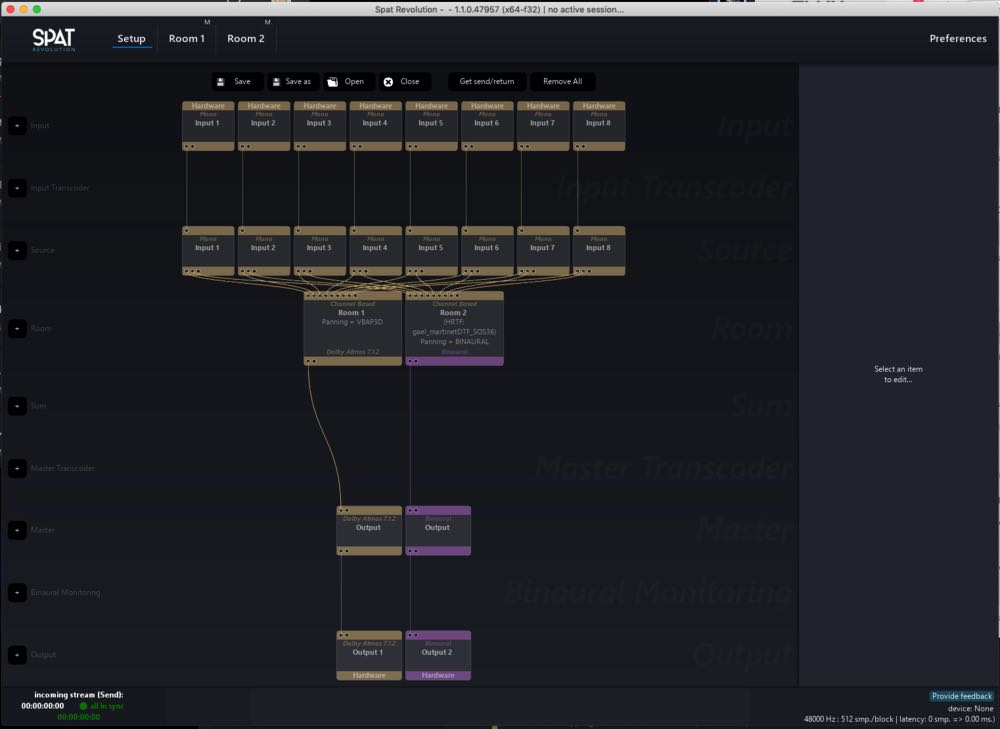

## High Order Ambisonic Room

One of the most straightforward methods to start working with HOA spatialisation in a signal flow is to connect input sources directly into an HOA Room. To convert a Room to be HOA, select High Order Ambisonics as the _Output Configuration Stream Type_.

All inputs to a Room must be in some kind of Channel Based format, even when it is an Ambisonic or Binaural Room. <!--That is the workflow at the time of writing (Spat Revolution v1.1).--> This makes most intuitive sense, when using Ambisonic format inputs as pre-encoded "3D sound field" type inputs into a room. You cannot just add them into an HOA room, even though they may be HOA format. Why is that?

This is because Ambisonic audio always needs to be _decoded_ into a channel based format to hear the spatialised audio on speakers (as we have mentioned a few times already). And so in a virtual room, an Ambisonic source needs to be decoded to a _virtual_ speaker configuration. The choice of what virtual speaker configuration you decode the Ambisonic audio to will influence the way the source's direct signals will sound and its sound will be altered by the way it interacts with the Virtual Room Acoustics. If it is a 1st or 2nd Order B-Format source, then a Cube configuration for 3D or an Octaphonic for 2D is usually a good choice. The important thing to keep in mind, is that a higher order of Ambisonic encoding, will sound more accurate on a higher density channel-based configuration - and if the source Ambisonic encoding is 3D, then you really should choose a 3D type of channel configuration.

!> _Ambisonic encoded audio is not intended to be listened to without decoding_

The other important thing to keep in mind is that decoding Ambisonics to a virtual Channel Based configuration allows for some very special transformations and re-designing possibilities of the original Ambisonic source. When a B-Format source becomes an arbitrary configuration of virtual emitters in the virtual Room, the ambisonic sound-field becomes a group that you can manipulate and transform using all the source parameters - especially, the [barycentric source parameters](6_Spat_Environment_6_6_Source_6_6_Source?id=barycentric.md) which are really useful for rotating and transforming the original sound field in
many ways.

> Ambisonic encoding is a convenient way to share and archive spatial sound mixes

The output from an Ambisonic room must always be _decoded_ into a channel based stream in order to hear the resulting spatial image. But even though it is not speaker compatible, it is still an audio data stream - so therefore it is quite possible to record a HOA stream to disk without decoding. This is a powerful way to work, as the HOA format encodes full sphere spatial information which can then be decoded/transcoded at a later stage.

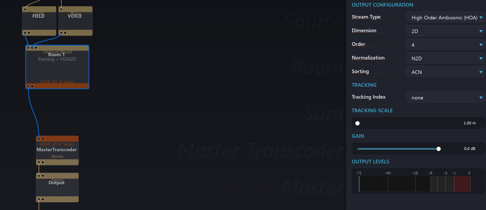

In an HOA Room, the Order can be changed at the output configuration of the room very easily, by selecting a different value pull down menu. When you have correctly set up a speaker compatible decoding method for the HOA stream coming out of a Virtual Room, you should clearly hear the difference in focus and the way that the Artificial Reverberation behaves as the Order goes up. <!-- Do not be complacent about the simplicity of the HOA interface. There is plenty going on under the hood but Spat makes it feel simple to explore how different Ambisonic Orders sound. Similarly, other encoding options are available to apply and listen to directly. -->

<!-- An HOA Room simulates many different Ambisonic decoding options in realtime. --> When you decode (or Transcode) an HOA Room output into a Channel Based, you will be able to hear how different Ambisonic encoding and decoding options (such as Method and Type) will sound. The topic of Ambisonic decoding options such as Type and Method is a particularly large one but in the end, it comes down to how the sound field will come across and this involves listening. Similar to how Sommeliers get to know the nuances of wine by opening lots of bottles, the best way to get to know Ambisonic options and understand for yourself how they affect the sound is by decoding and listening on different setups. And perhaps also digging into some of the literature you will find online.

One thing we can already guide you in, is how each Order affects spatial precision. This knowledge may be beneficial to understand when you are rendering and mixing Ambisonics sound fields. The precision with which a source can be localised in Ambisonics is directly linked to the Ambisonics Order. Sources encoded as first order can be quite diffuse in their localisability when decoded. Higher Orders, such as 3 or 7 can render precisely localisable point sources in 3D. The cost is in computation and increasing audio channel count.

Some types of source material such as ambiance or field recordings can benefit from the more immersive feeling of lower Orders, but point sources may need encoding in higher Order to get a more localisable result.

## B-Format Room

This is a First Order Ambisonic (FOA) room which is correctly suited for mixing B-Format Ambisonic signals. B-Format is 4-channels interleaved Ambisonic format, which is already widely used as a 3D audio format in the audio industry, as it can be decoded quickly and efficiently in realtime. If you are producing content that is intended for realtime decoding in B-Format, you can work in a B-Format Room.

<!-- The output configuration is preset for B-Format Room, although it is possible to change to 2D or 3D. -->

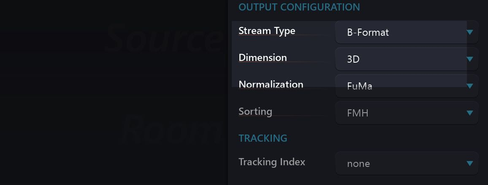

## Mid-Side Room

Similarly, if you are working with two-channel signals already encoded as MS format stereo, you can mix in an MS room. The outputs of MS rooms need to be decoded or transcoded into a suitable stereo format for reproduction on a stereo system.
