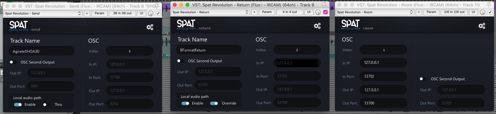
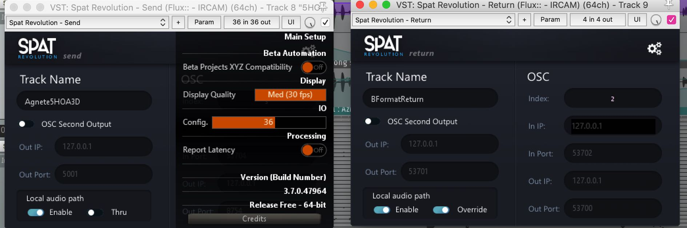

# Spat PI : Local audio path

You may only have the option to use one computer. In this case you need a software method to move multiple channels of audio from software running on the
same machine as the Spat Revolution spatialisation environment. This is not normally a trivial task, and many previous solutions have been prone to drop outs and
other problems.

In answer to this challenge, Flux have created three plugins for AU, VST and AAX
hosts. The Spat Plug-ins offer a straightforward way to integrate the Spat Revolution
spatialisation environment with other digital audio workstation environments - _running on the same machine._

**Spat Send**

- Send Multichannel audio from a DAW track to a Spat Send input module
- Enable DAW automation of all Source related parameters
- Index selects which Virtual Source to Automate

**Spat Return**

- Returns multichannel audio from a Spat Return output module to a DAW
    track
- Enable OSC communication for Return parameters

**Spat Room**

- Enable DAW automation of all Room related parameters
- Enable OSC communication for Room parameters
- Index selects which Virtual Room to Automate

In order for the audio software integration to function correctly, the user needs to
take into account certain principles of configuration.

!> **Sample Rate and buffer size must match in both Spat and and the Plug-in Host**

You can configure these settings in the Spat Revolution Preferences, and matching settings also need to be configured in the host DAW Preferences. Additionally,
there is an IO configuration setting inside each plug-in, accessible from the small
'cogs' icon.

Set the IO Channel Count for each of the plug-ins this way. Each Plug-In instance
can carry up to 64 channels to and from Spat. Once you have selected the channel
count, _Enable_ the software routing using the _Local audio path_ switch.

If Spat is running, then a SEND or RETURN IO module will automatically appear in
the _Environment Setup_ labelled with the _Track Name_ of the Spat plug-in, and set to
the channel count you have configured in the plug-in. If all is well configuration
wise, and a successful local audio stream has been established, the Send and Return modules will have a small green indicator.

> _On some machines, you need to use the TAB key to register a new Track
Name or IP address change in a Spat Plug in_

A few details on some of the other parameters;

**Index** - Relates the Plug in automation to a Virtual Source (see section 6.6)
- INDEX is assigned automatically and can only be changed manually to an Index number that is not yet in use by another Spat Plug In.

**Local audio path** - Enable the inter application software stream

**Thru** - Choose if you do not want to mute the send audio through the plugin

**OSC Second Output** - Set up a second parallel OSC destination

**Report Latency** - Activate latency compensation reporting for the DAW

**Override** - In Return only, over rides the DAW input path

