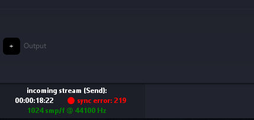
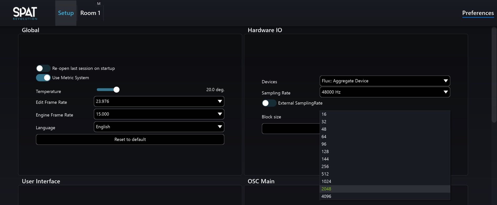

# 7.4 Troubleshooting Local Audio

If you see red indicators on SEND and RETURN modules in Spat, and the Status bar
is indicating dropped sync, then it is most likely to have a mismatch in Frame size
or sample rate, or CPU performance is overloading.

Frame size ( sometimes called Buffer Size or Block Size) should be matched in the
host DAW and Spat Revolution. If the audio processing is too demanding for your
computer at the current block size and sample rate, you may also experience drop
outs and sync problems due to CPU overload.
If you are experiencing lost sync when using Local Audio:

1. Increase the block size in the Spat preferences
2. Save your project and Quit Spat Revolution
3. Change the block size in your host DAW to match the new setting
4. Reopen Spat Revolution

There are also some performance preferences that may help in the case that your
host machine CPU is overloading and causing audio glitches.

- Lower graphic frame rates
- Switching in the 'Parrallelised' processing options
- Turn the 'Nebula Alpha' to 0 in your Rooms
- Lowering Reverb Density to 8x8

To lower graphic frame rates, go to the Spat preferences. Changing the Engine
Frame Rate will reduce pressure on the graphics updates and important when a
host machine dœs not have dedicated GPU and CPU resource issues.

If you are still experiencing lost sync, then please take a look at the Appendix B of
this guide for further troubleshooting tips. Also please read carefully the detailed
advice in the Reaper and ProTools quick start guides, section 12 of this guide even
if you don't use those DAW, as some it the advise there might apply to other setups.

