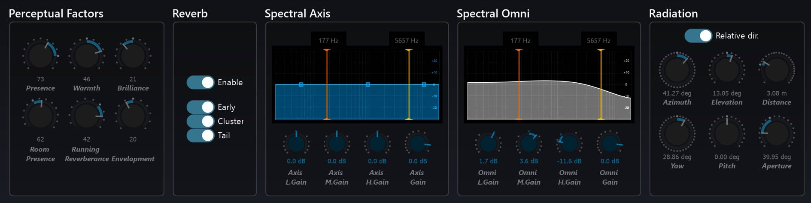

# 9.1 Defaults

A double click on any Source Parameter dial will reset it to a Spat default setting.
The default setting of a parameter is indicated around a dial as a larger tick than
the other tick marks. Additionally a range is graphically indicated between the default setting and the current setting of a variable parameter.

> ★ _Use the defaults as points of reference in your spatial sound design_

