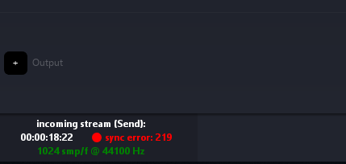
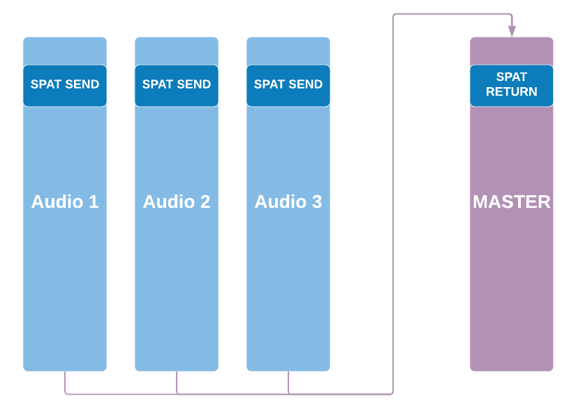
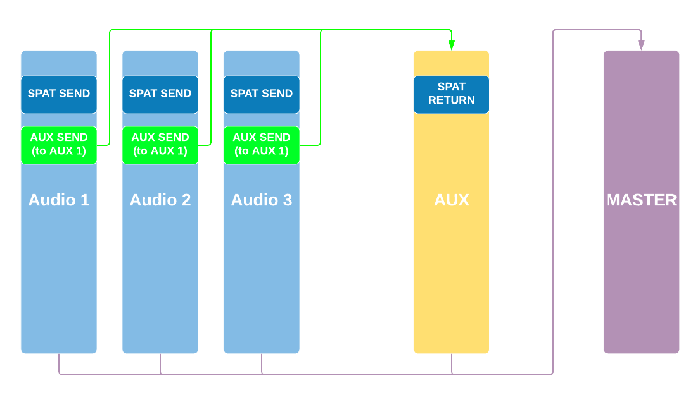
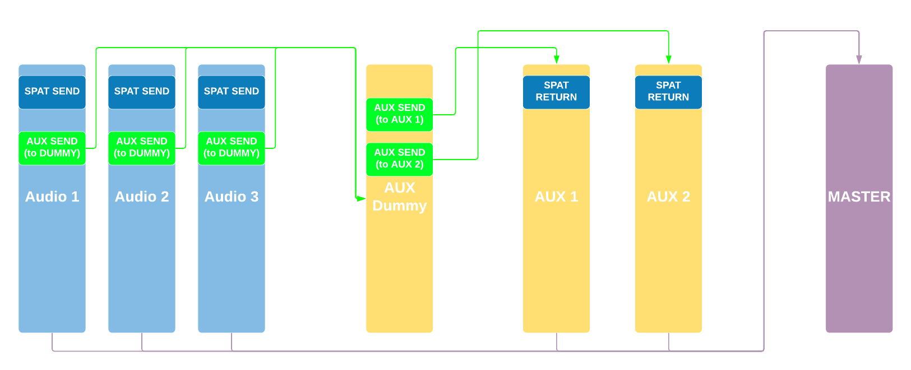
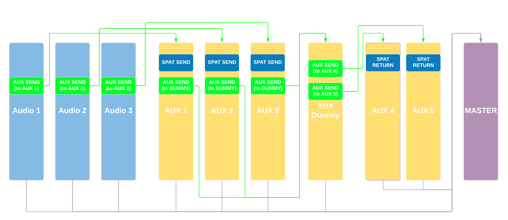
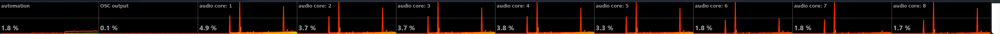
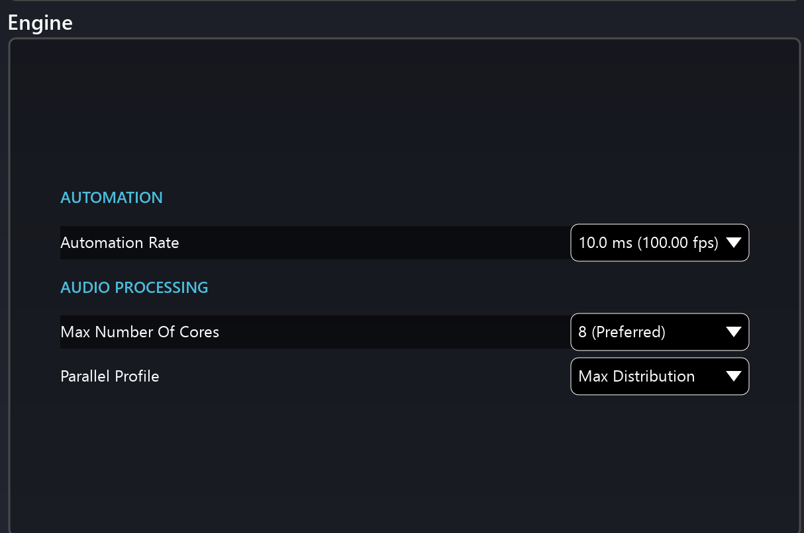
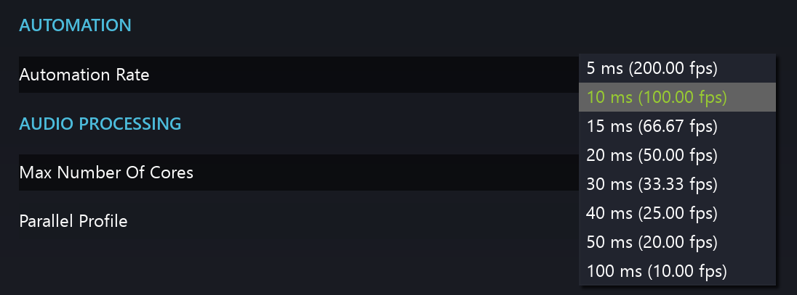
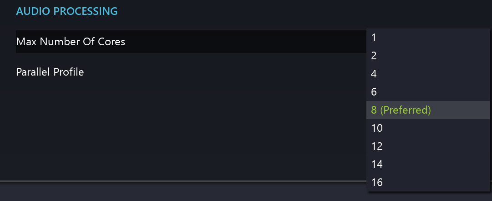

# Troubleshooting

## Sync issues with LAP

When using Local Audio Path (LAP), synchronisation issues can be identified when the synchronisation indicator in SPAT Revolution (bottom left corner) turns to red. 
This can in some cases result in clicks, noises, and or loss of sound.

***All 'green' indicators mean the sync is correct.***

Thanks to the DAW templates provided, this should not happen unless the required routing is not in place (session modified, routing unpatched). To work properly, the SPAT Send plug-ins instances must be processed by the DAW before the SPAT return plug-in instances.

To force the DAW to process this way, each track with SEND plug-in inserted must be routed (directly or indirectly) to the 'return' tracks, using DAW internal routing (ex: dummy busses in ProTools, direct routing in Reaper).

> CPU performance overloading could generate some sync errors.

> You can reset the sync error by double-clicking on the sync error counter.

If you see red indicators on the bottom left corner section of SPAT, this could be related to having a mismatch in frame size  (buffer) or sample rate between the DAW and the SPAT Revolution.

Frame size (sometimes called buffer size or block size) should be matched in the host DAW and SPAT Revolution. A red message would identify a different frame rate the host DAW. Simply double-clicking on **smp/f** message in error will automatically change you SPAT block size setup to match the incoming audio.

If the audio processing is too demanding for your computer at the current block size and sample rate, you may also experience dropouts and sync problems due to CPU overload.

If you are experiencing lost sync when using Local Audio:

* Increase the block size in the SPAT preferences.
* Save your project and quit SPAT Revolution.
* Change the block size in your host DAW to match the new setting.
* Reopen SPAT Revolution.

Also, please be sure to carefully read the detailed advice of the various DAW in the **[Third party integration](Third_Party_Integration.md)** section of this guide and refer to the various provided templates.

## SPAT Send and Return DAW

When dealing with SPAT Send and Return, you do not need to have a hardware device configured in the preference. In this case, SPAT Revolution will automatically adapt its sampling rate and synchronize to the incoming software audio I/O.

Sync issues encountered in SPAT Revolution when using the Local Audio Path workflow can often be fixed when following some guidelines for routing order inside the DAW. Thanks to the various DAW templates, this is done for the users.

To work properly, the SEND plug-ins instances must be processed by the DAW **before** the RETURN plug-in instances. To force the DAW to process this way, each track with SEND plug-in inserted must be routed (directly or indirectly) to the tracks hosting a RETURN plug-in, using DAW internal routing.

Following are four examples of recommended practice with DAW routing, which should cover the main use cases. If your problems persist even after implementing these suggestions, don't hesitate to drop us a line at FLUX:: support.

> **PLEASE NOTE:** _In the current version 20.12, the mixing of HARDWARE inputs and LOCAL AUDIO PATH may report a sync loss, as SPAT Revolution cannot guarantee correct sync in this scenario. Proceed with caution if this is unavoidable. This is not officially supported._

**SPAT RETURN plug-in on master track**

In simple projects, when having a single return plug-in on a master track, you should not encounter any sync issue as long as each SEND track is routed to the master.

**Single RETURN on an AUX track**

Issues may happen when return is inserted on an AUX track. Make sure that each SEND track is routed to the AUX track (RETURN track). Here is an example using AUX send (see examples below).

> ★ You might achieve the same by routing the track outputs to the bus.

**Several RETURN on AUX tracks**

When several RETURN tracks are needed (for example several rooms to render from SPAT Revolution, and/or several output stream formats), you will have to route each SEND track to each RETURN track, using the same technique.

As it can quickly become complicated as the project grows, in the following example, the use of a 'dummy' track, avoids using several AUX sends on the 'SEND 'tracks. It makes routing clearer and easier to implement on larger projects. The 'dummy' AUX track is routed to all the RETURN tracks (using AUX sends or patching the output to a multichannel/multi-format 'dummy' bus).

Then, simply route all your SEND tracks to this 'dummy' track by simply patching its output to the multichannel/multi-format 'dummy' bus or via the use of aux send.

**Using specific tracks as your SPAT source/object**

One of the good practices to deal with the source/object you are sending for external rendering is to use tracks as dedicated objects. (Similar to many object-based mixing workflows proposed by DAW.) This way you can leave the session audio tracks and their channel insertion as they are and simply send your audio track to the SPAT SEND object track. This allows you to send a single audio track or multiple ones (stem) to the SPAT SEND object track.

Doing this can segment your external rendering routing and is highly recommended to prevent audio track delay compensation systems in DAW to come and jeopardize the audio synchronization between the DAW and SPAT. This as well ensures that your audio track automation on levels for example is respected as some DAWs don't have post-fader insertion (a pre-fader insert with SPAT SEND PI will send audio to SPAT Revolution prior to your fader automation).

The above best practice ensures as well that you keep both the dry signal and the SPAT RETURN signals independent (when the mix requires to switch easily from one to the other), add one object AUX track per audio track to be sent to SPAT, and insert the SEND plug-in on these object AUX tracks.

This way, you keep the dry signal on the audio track's output.

## Clearing Shared Memory

Some users have experienced an issue where SPAT SEND and RETURN plug-ins are
not cleared from the shared memory when used with certain third-party DAW hosts (or seen after DAW crashes). Although this should not happen and have been intensively improved in the latest releases of SPAT Revolution, a **Clean Shared Memory** option can fix some connection issues (ghost modules, duplicated modules, modules not connecting when opening session). This can sometimes be seen where SPAT Send and Return modules appear in the SPAT setup page when there is no DAW host software running in the background. It can cause problems, when a host with plug-ins is launched and more SEND and RETURN plug-ins appear to be doubled.

Although rebooting the computer would fix this issue, the workaround if this is happening with your particular third-party software, is to invoke a special debug action called _Clean Shared Memory_. It is available by the *Help* menu _Help/Clean Shared Memory_

If this command is executed, SPAT and the plug-in host will then need to be restarted.

## Performance issues

There are also some performance preferences that may help in the case that your host machine CPU is overloading and causing audio glitches.

* Lower UI frame rates.
* Turn the 'Nebula Alpha' to zero in your rooms.
* Lowering Reverb Density to 8x8 for all Rooms.
* Lower the automation rate via the engine preference
* Adjust the Multi-Core Parallel Computation Algorithm via the engine preference.

To lower UI graphic frame rates, go to the SPAT preferences.
Changing the Edit Frame Rate will reduce pressure on the graphics updates and important when a host machine does not have dedicated GPU and CPU resources.

The latest release of SPAT Revolution includes a new Multi-Core Parallel Computation Algorithm. In the preference of SPAT Revolution, in the Engine section at the bottom, you can choose various computer hardware presets that match your setup. This is a simple step to tuning the computation algorithm.

If you are still experiencing performance and sync issues, you may want to ensure that your hardware configuration meets the **[SPAT Revolution requirements and recommendations](Appendix_A.md)**

Consider as well to kill as many processes not required as possible (Wi-Fi/internet, background services and activity).

## Display Performance (CPU) measurements

Included in release version 20.12 is the ability to display performance (CPU) measurements. This can be done in the **Help** menu **Display Performance** option. This can be accesses as well with shortcuts <code>Shift + Option + Command + P</code>.

## Engine Parallel Processing profile

_!> Engine profiles are only available with the Ultimate license of SPAT Revolution_.

SPAT Revolution v20.12 introduced a new Multi-Core Parallel Computation Algorithm that is key to optimizing your hardware. This is for both the automation and the audio processing. The **Display Performance** option stated above will be our best ally to monitor the results. This can be accessed with shortcuts <code>Shift + Option + Command + P.</code>

The Engine Preference section includes three Profiles for parallel processing

**Automation Rate** provides the ability to set the refresh rate (frequency) of the automation. By default, we use 10.0 ms (100.00 fps). This can be decreased to lower the frequency if you see that automation is becoming a burden for your system with such a fast refresh.

**Max Number of Core** is your ability to make more or fewer cores available to the SPAT Revolution algorithm. By default, it will be at your number of native core. Not hyper-threading. This can be increased or reduced. Watch not to take all cores for a multitasking computer.

Lastly are the 3 presets for you to choose from.

Parallel Profile:

* **Max distribution** is for spreading the load as much as possible to all cores mainly with Desktop systems and dedicated real-time SPAT computers.

* **Favor First Core**  is a typical preset for laptop computers where we find that loading cores as much as possible allow us to get out of the way of some of the laptop optimization (power and cooling) that are playing with available processing speed.

* **Balanced Distribution** is a preset somehow in the middle. It intends to be a balance between both above options.

---
